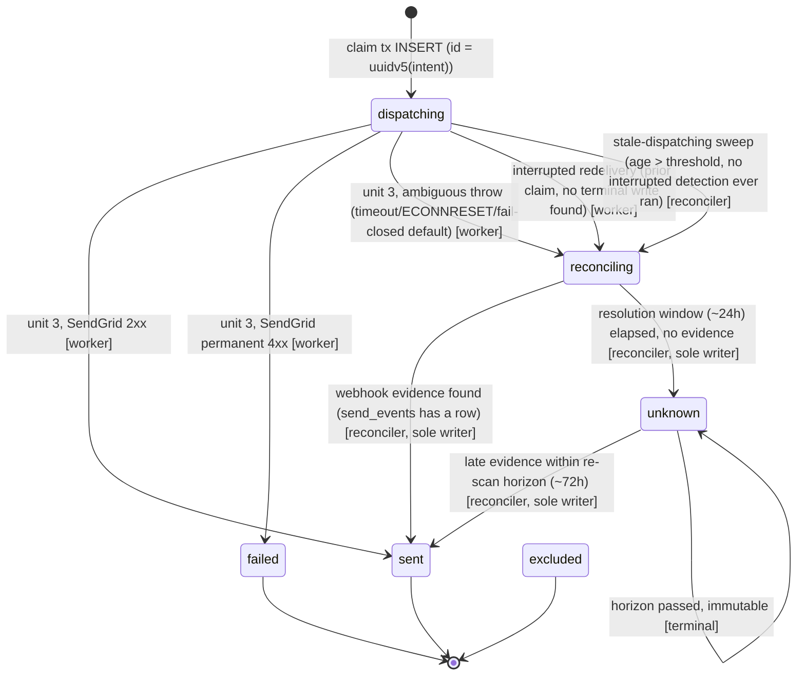

# Phase 11: Delivery Correctness - Research

**Researched:** 2026-08-09
**Domain:** Distributed job-processing correctness (BullMQ + Postgres), provider-webhook reconciliation, transport-error classification
**Confidence:** HIGH (grounded directly in the existing codebase for 90%+ of claims; MEDIUM/LOW only for BullMQ internals and UUIDv5 mechanics verified via web search, not Context7 — no MCP doc providers were available this session)

<user_constraints>
## User Constraints (from CONTEXT.md)

### Locked Decisions

**Already locked at ROADMAP level (do not re-litigate):**
- Reconciler claims rows via `SELECT … FOR UPDATE SKIP LOCKED` inside `withTenantTransaction`; the retry path never calls SendGrid for a `reconciling` row (Pitfall 1). DLV-08's crash tests include the reconciler-and-retry-worker three-way race.
- Correlation is by `send_id` only (`custom_args.send_id`, already on every request and read back by `webhook-events.worker.ts`); never re-derive by heuristics.
- `ALTER TYPE send_status ADD VALUE` ships as its own standalone migration, applied before the code that references it (DB-08; Phase 8's migration linter enforces this). No historical-row backfill in the same migration; `workspace_daily_rollup` historical totals must be unchanged after migration (Pitfall 2). A read-only audit of production-shaped `sends` history runs before the migration is written.
- `AbortController` timeout strictly below BullMQ `lockDuration` with margin for the claim and terminal-write transactions (Pitfall 5).
- No second outbox table — `sends` IS the outbox. Add `reconciling_since timestamptz` (do not overload `queued_at`; Phase 15's webhook-lag alert queries `reconciling_since`).
- The `interrupted` branch stops incrementing `failed_count`/rollup counters; the reconciler owns an idempotent "resolve → terminal, backfill counters once" path (a naive `applyEventSideEffects` re-run will not fire — `setFactColumnOnce`'s `justSet` gate already consumed the fact).
- Reconciler's cross-tenant discovery uses Phase 10's `mega_crm_scan` role through the `withCrossWorkspaceScan` helper (10-CONTEXT D-01/D-02) — this phase adopts, never re-implements, that entry point.
- Every changed BullMQ job payload carries an explicit `schemaVersion`; the worker defers payload versions it does not recognize (ROADMAP § Sequencing Decisions, R-05).
- The state machine is a reviewed design artifact BEFORE `send-dispatch.ts` is touched (DLV-01 is a design deliverable).
- Crash tests build on the existing Phase 8 harness seam `ProcessSendJobDeps.sendMail` — scenarios are added, no new seam.

**Reconciler verdict model (DLV-03/DLV-07):**
- **D-01:** Classification-only reconciler (strict at-most-once). The reconciler resolves `reconciling` rows to a terminal state and NEVER calls SendGrid. Lost-but-unproven mail is accepted as the cost of guaranteed no-duplicates. Delivery model (DLV-07): at-most-once at the acceptance boundary, effectively-once across retries before acceptance.
- **D-02:** No-evidence terminal state is a new enum value `unknown`. Its own standalone migration under the same DB-08 expand/contract rule as `reconciling`.
- **D-03:** The reconciler is the sole writer of every `reconciling → terminal` transition. The webhook worker keeps recording evidence exactly as today and never touches `status`.
- **D-04:** Late evidence on a terminal `unknown` row is handled by bounded re-scan: each tick the reconciler also re-examines `unknown` rows younger than a bounded horizon (~72h) and upgrades `unknown → sent` when evidence appears — same single writer, same idempotent counter-backfill path.

**Evidence source & resolution windows (DLV-03):**
- **D-05:** Webhook evidence only. The reconciler resolves from `send_events`/fact columns correlated by `send_id` and makes NO provider API calls (SendGrid Email Activity API rejected — paid add-on, heavily rate-limited).
- **D-06:** The auto-provisioned webhook subscription gains SendGrid's `processed` event as primary acceptance evidence. `deferred` is NOT added. Existing tenants updated through Phase 5 provisioning/Reconnect machinery.
- **D-07:** Resolution window ~24h (`reconciling` → `unknown` with no evidence), re-scan horizon ~72h. Both versioned constants in code with rationale comments, exact values tunable by the planner.
- **D-08:** The reconciler also sweeps stale `dispatching` orphans: rows older than a generous age threshold transition `dispatching → reconciling` and resolve through the normal evidence path. Two writers for `dispatching → reconciling`: the worker (ambiguous outcome / interrupted redelivery) and the reconciler (stale-age sweep).

**Idempotency key & claim lifecycle (DLV-05/DLV-06):**
- **D-09:** `sends.id` becomes deterministic — UUIDv5 derived from the send intent (workspace+campaign+contact for campaign sends; workspace+flowRun+node for flow sends; namespace constant at planner's discretion). Every re-claim reproduces the SAME id, so webhook events from any prior (phantom-accepted) attempt always correlate to the live row.
- **D-10:** Outcome classification (verbatim intent):
  - Timeout and connection reset where the request body MAY have been sent → ambiguous → `reconciling`.
  - Provably pre-connection errors (DNS failure, connection refused — the request could not have left) → retryable.
  - HTTP 429 / 5xx → release claim + bounded exponential retry (a deliberate change from today's unbounded `Retry-After`-driven backoff).
  - Permanent 4xx → `failed`, no retry.
  - Fail-closed default: if the transport layer cannot prove whether bytes were sent → `reconciling`.
- **D-11:** Test sends (`kind='test'`) stay entirely outside the delivery ledger, reconciliation, and analytics. No automatic retry for test sends. The test-send response contract gains a third outcome: "outcome unknown — check the inbox before manually re-sending" for a timeout/reset without a definitive response.

**Campaign lifecycle & visibility:**
- **D-12:** `reconciling`/`unknown` count toward campaign completion. A campaign reaches `sent` once dispatch is finished; the reconciler backfills `sent_count`/`failed_count` idempotently as rows resolve. `incrementCampaignSendCounter`'s `WHERE status='sending'` guard gains an explicit reconciler-backfill path.
- **D-13:** Minimal-honest visibility in this phase: send log shows/filters new statuses; daily rollups EXCLUDE `unknown` from sent/failed counts (documented); campaign-card `unknown` stats and dashboard treatment deferred to Phases 13/15.
- **D-14:** Interim stuck-reconciler alerting reuses the Phase 9 machinery: the reconciler writes a health row; the existing API-side watchdog + `OPERATOR_ALERT_EMAIL` channel alerts when ticks stop or `reconciling` rows age past threshold. Phase 15 (OPS-13) re-plumbs the same signal into real alerting via `reconciling_since`.

**Timeout & operational parameters (DLV-06/DLV-09):**
- **D-15:** Explicit `lockDuration` (~60s) and SendGrid `AbortController` timeout (~20s), with a test asserting `timeout + transaction margin < lockDuration`. Written so Phase 12's WRK-11 absorbs rather than duplicates it. Exact numbers are planner-tunable versioned constants.
- **D-16:** Reconciler cadence ~5 min: repeatable BullMQ tick (`upsertJobScheduler`, stable scheduler id per WRK-13), bounded batch per tick. Discovery via scan role, then per-tenant claims.
- **D-17:** Send duration lives on `sends`: `dispatched_at` (call start) + `dispatch_duration_ms`, written in the terminal/ambiguous-write transaction.
- **D-18:** The DLV-01 state machine + DLV-07 delivery model live as an `ARCHITECTURE.md` section (mermaid state diagram + per-transition writer matrix), committed and reviewed BEFORE `send-dispatch.ts` changes. `SPECIFICATION.md` receives factual entries (§4 schema, §5 queues/reconciler, §7 alerting) in the same change.

### Claude's Discretion

- UUIDv5 namespace constant and helper location; exact key-composition strings.
- Exact timeout/lockDuration/window/horizon/cadence numbers within the decided orders of magnitude — all as versioned constants with rationale comments.
- Reconciler batch bound per tick; stale-`dispatching` age threshold (must exceed max job lifetime incl. retries with margin).
- Bounded-exponential-retry parameters for 429/5xx (attempts cap, base/max delay) and how they interact with the existing `worker.rateLimit()` signal.
- Shape of the transport-layer classification (how undici/fetch errors are mapped to "pre-connection" vs "possibly sent") and its unit-test fixtures.
- Reconciler health-row schema (may mirror `partition_maintenance_runs`) and watchdog threshold.
- Whether `SendJobResult` gains new outcome variants now (e.g. `ambiguous`) — note Phase 12 will split `cause: "tenant_bucket" | "provider_backoff"`; design the shape so Phase 12 extends rather than reshapes it.

### Deferred Ideas (OUT OF SCOPE)

- Operator/marketer re-send tooling for lost-but-unproven sends (recovery UI/CLI for `unknown` rows) — recovery stays a documented manual action.
- `deferred` event ingestion — revisit only if `processed`+delivered/bounced evidence proves insufficient.
- Campaign-card `unknown` stat / dashboard treatment — Phase 13/15.
- Real alerting on `reconciling_since` age — Phase 15 (OPS-13); this phase ships the interim email channel only.
- `SendJobResult` cause split (`tenant_bucket` vs `provider_backoff`) — Phase 12 (WRK-01).
</user_constraints>

<phase_requirements>
## Phase Requirements

| ID | Description | Research Support |
|----|-------------|------------------|
| DLV-01 | State machine formally documented, including `reconciling` | See "State Machine (DLV-01 design artifact)" below — full transition table with writers, grounded in the actual `sendStatusEnum`/`dispatchSendGate`/`claimFlowSend`/`recordSendResult` code paths. |
| DLV-02 | Interrupted send transitions to `reconciling`, not `failed` | See "Code Examples #1" — the exact `claimCampaignSend`/`claimFlowSend` `interrupted` branch (currently writes `failed`) and the unit-3 ambiguous-throw path that needs the same target state. |
| DLV-03 | Reconciler determines true outcome and closes `reconciling` | See "Architecture Patterns #2 (Reconciler tick)" and "Evidence resolution logic" — grounded in `flow-reconciliation.worker.ts`/`campaign-scheduler.worker.ts`'s existing scan+claim precedent and `webhook-events.worker.ts`'s `send_events` schema. |
| DLV-04 | Reconciler and retry worker cannot both resolve the same send | See "Code Examples #2 (exclusive claim)" and the `dispatchSendGate`/`claimFlowSend` extension needed so a retried job treats `reconciling`/`unknown` as skip, not proceed. |
| DLV-05 | Idempotency key deterministically derived from send intent | See "Don't Hand-Roll — UUIDv5" and "Common Pitfall: the release-claim phantom-event hole" — grounded in `releaseDispatchClaim`'s `DELETE` + `gen_random_uuid()` interaction. |
| DLV-06 | Explicit SendGrid timeout with cancellation; timeout classified ambiguous | See "Architecture Patterns #3 (timeout vs lockDuration)" — grounded in BullMQ lock-renewal mechanics and `sendTenantMailV3`'s current bare `fetch` (no timeout at all). |
| DLV-07 | Delivery model (at-most-once / effectively-once) documented | See "State Machine" section's model statement, cross-referenced to D-01. |
| DLV-08 | Crash tests cover pre-send, post-SendGrid-accept, pre-result-write, and the reconciler/retry race | See "Validation Architecture" — extends the existing `sigkill.test.ts`/`timeout.test.ts`/`connection-reset.test.ts`/`send-dispatch-durability.test.ts` suite already built in Phase 8. |
| DLV-09 | Send duration measured and available as a metric | See "Code Examples #3 (dispatched_at/dispatch_duration_ms)". |
</phase_requirements>

## Project Constraints (from CLAUDE.md)

- Fastify/Zod/Drizzle/BullMQ/Postgres stack is fixed; this phase touches only `apps/worker`, `packages/delivery-core`, `packages/db`, and (for D-06) `apps/api/src/modules/webhooks`.
- `rate-limiter-flexible` remains the per-tenant token bucket; BullMQ's own `limiter` option must never be used for tenant throttling (already correctly avoided in `send-dispatch.ts`).
- Any new npm dependency (this phase needs exactly one: `uuid`) must be added to `SPECIFICATION.md` §2 in the same change, with the exact `package.json` version — not the research-recommended range.
- Any new migration, column, enum value, or index → `SPECIFICATION.md` §4 in the same change.
- Any new queue, worker, repeatable job, or interval/concurrency change → `SPECIFICATION.md` §5 in the same change.
- Any new HTTP route or auth/rate-limit mechanism → `SPECIFICATION.md` §6 (D-06's `EVENT_FLAGS.processed` change is provisioning logic, not a new route, but still touches the webhook subscription contract worth noting in §5/§6).
- `ARCHITECTURE.md` and `CONVENTIONS.md` updates are binding per QG-08/QG-09/QG-10 (already established in Phase 8) — D-18 explicitly requires the state-machine section land in `ARCHITECTURE.md` before `send-dispatch.ts` changes.

## Summary

This phase closes three specific correctness gaps in an already-mostly-correct three-unit dispatch discipline (claim tx → SendGrid call → record tx) that Phase 4's CR-04 fix put in place: (1) a crash or hang *after* SendGrid may have accepted a message is currently misclassified as `failed` (data loss risk: an operator/analyst reading `failed` assumes nothing was sent, but a phantom-accepted mail may be in a recipient's inbox); (2) SendGrid's `mail/send` call has no timeout at all today (`sendTenantMailV3` is a bare `fetch`), so a hung TCP connection can pin a worker concurrency slot indefinitely; (3) `sends.id` is `gen_random_uuid()`-derived per insert attempt, and `releaseDispatchClaim` **deletes** the row on a 429/5xx release — meaning a genuinely-phantom-accepted send whose claim was later released loses its correlation identity entirely, because the next retry attempt gets a brand-new random id that no longer matches the `custom_args.send_id` SendGrid already has for the phantom message.

All architecturally load-bearing decisions are already locked in `11-CONTEXT.md` (reconciler is classification-only, `unknown` is a new terminal enum value, evidence comes from webhook `send_events` only, UUIDv5 for the idempotency key, reconciler-exclusive claim via `SELECT ... FOR UPDATE SKIP LOCKED`). This research grounds those decisions in the concrete code paths they touch and surfaces two additional pitfalls the context discussion didn't explicitly name: (a) `recordExcluded`/`recordFlowExcluded`'s `WHERE status NOT IN ('sent','dispatching','failed')` guard must also exclude `reconciling`/`unknown`, or a redelivered exclusion re-walk can stomp a reconciling row back to `excluded`; (b) `dispatchSendGate`/`claimFlowSend`'s existing three-way status branch (`sent/failed/excluded` → skip, `dispatching` → interrupted) needs a fourth branch (`reconciling`/`unknown` → skip) — this is the literal code mechanism that satisfies DLV-04's "retry worker never calls SendGrid for a reconciling row" requirement, using the *same* function the campaign/flow claim paths already call, not a new gate.

**Primary recommendation:** Implement the state machine as an additive, non-breaking layer on the *existing* three-unit dispatch discipline — do not rearchitect `processSendJob`. Add two enum values (`reconciling`, `unknown`) via standalone migrations, add three columns (`reconciling_since`, `dispatched_at`, `dispatch_duration_ms`), introduce one new npm dependency (`uuid`) for the UUIDv5 idempotency key, wrap `sendTenantMailV3`'s `fetch` in `AbortSignal.timeout()`, and add one new repeatable-tick worker (`send-reconciler.worker.ts`) that mirrors `flow-reconciliation.worker.ts`'s scan-then-per-tenant-claim shape exactly, substituting a classification read of `send_events` for that file's status transition.

## Architectural Responsibility Map

| Capability | Primary Tier | Secondary Tier | Rationale |
|------------|-------------|----------------|-----------|
| Send-outcome classification (timeout/reset/4xx/5xx → state) | API/Backend (worker process) | — | Pure logic inside `apps/worker`'s job processor; no client or DB-tier concern. |
| Idempotency key derivation (UUIDv5) | API/Backend (worker + delivery-core) | — | Computed in `packages/delivery-core` so both campaign and flow claim paths share one implementation. |
| `reconciling`/`unknown` row claiming | Database / Storage (Postgres row locks) | API/Backend (worker issues the query) | `SELECT ... FOR UPDATE SKIP LOCKED` is a Postgres-native concurrency primitive; the worker only issues the transaction. |
| Cross-tenant discovery scan | Database / Storage (`mega_crm_scan` role + RLS policy) | API/Backend (`withCrossWorkspaceScan` caller) | Access control lives in the DB role/policy layer (Phase 10), not application code — this phase only adds a consumer. |
| Reconciler health signal / alerting | API/Backend (worker writes, API watchdog reads) | — | Mirrors Phase 9's two-process dead-man's-switch exactly; no new tier introduced. |
| Send-duration metric storage | Database / Storage (`sends` columns) | API/Backend (worker writes at terminal/ambiguous transaction) | SQL-queryable immediately, no metrics infra dependency (per D-17's own stated rationale). |
| Webhook event-type provisioning (`processed`) | API/Backend (`apps/api/src/modules/webhooks`) | External Service (SendGrid account config) | The platform's own webhook subscription is API-tier config that reaches into a tenant's SendGrid account via BYO key — no new tier. |

## Standard Stack

### Core

| Library | Version | Purpose | Why Standard |
|---------|---------|---------|--------------|
| `uuid` | 14.0.1 (verified via `npm view uuid version`, published 2026-06-20) `[VERIFIED: npm registry]` | Deterministic UUIDv5 generation for the send idempotency key (D-09) | Zero runtime dependencies, ~274M weekly downloads, RFC 4122/9562-compliant, maintained at `github.com/uuidjs/uuid`. Node has no built-in v5 generator (`crypto.randomUUID()` is v4-only) — hand-rolling the SHA-1 + bit-twiddling per RFC is exactly the kind of "deceptively simple, easy to get subtly wrong" primitive this project's Don't-Hand-Roll discipline exists to avoid. `[ASSUMED: package choice is training-data knowledge cross-checked against a live registry lookup, not an official docs citation — tag accordingly until the planner confirms]` |

No other new runtime dependencies are needed. `AbortSignal.timeout()` (Node 17.3+, stable since Node 18 LTS, fully supported on this project's Node 22 engine) is a Web-standard global — no package required for the timeout itself.

### Supporting

| Library | Version | Purpose | When to Use |
|---------|---------|---------|-------------|
| `bullmq` | 5.79.1 (already a dependency, unchanged) | `upsertJobScheduler` for the reconciler's repeatable tick | Already the pattern `partition-maintenance.worker.ts` and `flow-reconciliation.worker.ts` use — no new API surface to learn. |
| `pg` | 8.22.0 (already a dependency, unchanged) | `SELECT ... FOR UPDATE SKIP LOCKED` claim query | Already the pattern `campaign-scheduler.worker.ts`/`flow-reconciliation.worker.ts`/`packages/db/src/partitions/relocate-default.ts` use. |

### Alternatives Considered

| Instead of | Could Use | Tradeoff |
|------------|-----------|----------|
| `uuid` npm package for UUIDv5 | Hand-rolled `crypto.createHash('sha1')` implementation | Zero new dependency, but reimplements RFC 4122's version/variant bit-twiddling by hand — exactly the "don't hand-roll" case; the `uuid` package is itself dependency-free, so there is no transitive-dependency cost to accepting it. |
| `AbortSignal.timeout()` | Manual `setTimeout` + `controller.abort()` | Functionally identical; `AbortSignal.timeout()` is one line and avoids a manually-managed timer handle that must be cleared on the happy path (a common source of leaked timers in ad-hoc timeout code). No reason to hand-roll this given native support on Node 22. |
| Webhook-evidence-only reconciler (D-05, locked) | SendGrid Email Activity API polling | Rejected in CONTEXT.md already — paid add-on under BYO keys, heavily rate-limited. Not revisited here. |

**Installation:**
```bash
npm install uuid -w apps/worker
# or -w packages/delivery-core if the deriveSendId() helper lives there instead
```

**Version verification:** confirmed live via `npm view uuid version` (14.0.1, published 2026-06-20) and `npm view uuid scripts.postinstall` (empty — no postinstall script, no supply-chain red flag).

## Package Legitimacy Audit

| Package | Registry | Age | Downloads | Source Repo | Verdict | Disposition |
|---------|----------|-----|-----------|-------------|---------|-------------|
| `uuid` | npm | Long-established (current major 14.0.1 published 2026-06-20; package itself predates this by years) | ~274.5M/week | `github.com/uuidjs/uuid` | OK (`gsd-tools query package-legitimacy check` verdict: `OK`, no reasons flagged) | Approved |

**Packages removed due to `[SLOP]` verdict:** none.
**Packages flagged as suspicious `[SUS]`:** none.

*The `uuid` package name itself was recalled from training knowledge and cross-checked against the live npm registry (`npm view`) and the `package-legitimacy check` seam in this session — per the provenance rule, it is tagged `[ASSUMED]` for the planner's awareness even though the registry/legitimacy checks both passed `OK`. No `checkpoint:human-verify` is strictly required given the overwhelming download count and zero-dependency, non-postinstall profile, but the planner may add one if the team's risk tolerance prefers it.*

## Architecture Patterns

### System Architecture Diagram

```
                    ┌─────────────────────────────────────────────┐
                    │         email-broadcast / email-triggered     │
                    │              BullMQ Worker (processSendJob)   │
                    └───────────────────┬───────────────────────────┘
                                        │
        ┌───────────────────────────────┼────────────────────────────────┐
        │ Unit 1: claim tx               │ Unit 2: SendGrid call            │ Unit 3: record tx
        │ (withTenantTransaction)        │ (NOT in a transaction)           │ (withTenantTransaction)
        ▼                                ▼                                  ▼
 dispatchSendGate/claimFlowSend   sendTenantMailV3 + AbortSignal.timeout()   recordSendResult/
 - existing row: sent/failed/     - 2xx -> proceed to unit 3 "sent"          recordFlowStepResult
   excluded -> SKIP (no-op)       - permanent 4xx -> proceed to "failed"     - writes dispatched_at,
 - existing row: reconciling/     - 429/5xx -> release claim (DELETE),        dispatch_duration_ms
   unknown -> SKIP (NEW, DLV-04)    bounded exponential retry                - "sent" | "failed" | "reconciling"
 - existing row: dispatching ->   - pre-connection error (ECONNREFUSED/
   INTERRUPTED -> reconciling      ENOTFOUND) -> release claim, retry
   (NEW, was "failed")            - timeout/ECONNRESET/AbortError ->
 - no existing row -> INSERT        classify AMBIGUOUS -> unit 3 writes
   dispatching, id = uuidv5(...)    "reconciling" (fail-closed default)
   (NEW, was gen_random_uuid())

                                                       │
                                                       │ webhook delivery events
                                                       ▼
                                    ┌──────────────────────────────────────┐
                                    │   webhook-events.worker.ts (UNCHANGED) │
                                    │   writes send_events + fact columns    │
                                    │   NEVER touches sends.status           │
                                    └───────────────────┬────────────────────┘
                                                        │ read-only
                                                        ▼
                    ┌───────────────────────────────────────────────────────┐
                    │         send-reconciler.worker.ts (NEW, ~5min tick)     │
                    │                                                          │
                    │  1. Discovery: withCrossWorkspaceScan() finds candidate  │
                    │     reconciling/unknown/stale-dispatching rows           │
                    │     (mega_crm_scan role, SELECT-only, no lock)           │
                    │  2. Per-tenant claim: withTenant + withTenantTransaction │
                    │     SELECT ... FOR UPDATE SKIP LOCKED (exclusive claim,  │
                    │     DLV-04)                                              │
                    │  3. Classify from send_events (webhook evidence only,    │
                    │     NO SendGrid API call, D-05):                         │
                    │       - any event row exists (processed/delivered/       │
                    │         bounce/etc.) -> reconciling -> sent               │
                    │       - none, age > ~24h window -> reconciling -> unknown │
                    │       - unknown, age < ~72h horizon, evidence appears ->  │
                    │         unknown -> sent (late-evidence re-scan)           │
                    │       - reconciler NEVER writes "failed" (see note below) │
                    │  4. Idempotent counter backfill (sent_count/failed_count, │
                    │     campaign completion) in the SAME transaction          │
                    │  5. Writes its own health row (mirrors                    │
                    │     partition_maintenance_runs) for D-14's watchdog        │
                    └───────────────────────────────────────────────────────┘
```

**Why the reconciler never writes `failed`:** `failed` in this codebase means "SendGrid synchronously rejected the send with a permanent 4xx" — a fact the job processor already observed directly in unit 3, at send time. A webhook is asynchronous, positive-only evidence (SendGrid tells you what *did* happen; it never emits a webhook proving a message was *never* accepted). The reconciler therefore has exactly two possible terminal writes: `reconciling → sent` (evidence found) and `reconciling → unknown` (resolution window elapsed with no evidence) — this should be stated explicitly in the DLV-01 ARCHITECTURE.md artifact so no implementer accidentally adds a `reconciling → failed` transition.

### Recommended Project Structure

```
packages/delivery-core/src/
├── send-id.ts                  # NEW: deriveSendId() — UUIDv5 helper shared by campaign+flow claim paths
├── send-ledger.ts               # MODIFIED: dispatchSendGate/claimFlowSend take a caller-supplied id;
│                                 #   interrupted branch's caller writes 'reconciling' not 'failed';
│                                 #   4th status branch (reconciling/unknown -> skip);
│                                 #   recordExcluded/recordFlowExcluded's NOT IN list grows
├── send-mail.ts                 # MODIFIED: sendTenantMailV3 gains AbortSignal.timeout(), records
│                                 #   dispatch start time for duration measurement
├── transport-classify.ts        # NEW: maps a thrown fetch/undici error to
│                                 #   "pre_connection_retryable" | "ambiguous"
└── reconciler.ts                 # NEW: pure classification logic (send_events read -> verdict),
                                  #   unit-testable without a live BullMQ Worker

apps/worker/src/queues/
├── send-dispatch.ts             # MODIFIED: interrupted/ambiguous branches target 'reconciling';
│                                 #   dispatched_at/dispatch_duration_ms written alongside status
└── send-reconciler.worker.ts    # NEW: repeatable tick, mirrors flow-reconciliation.worker.ts's
                                  #   scan-then-claim shape

packages/db/
├── migrations/00XX_send_status_reconciling.sql     # standalone: ALTER TYPE ... ADD VALUE 'reconciling'
├── migrations/00XX_send_status_unknown.sql         # standalone: ALTER TYPE ... ADD VALUE 'unknown'
├── migrations/00XX_send_reconciliation_columns.sql # reconciling_since, dispatched_at, dispatch_duration_ms
└── src/schema/sends.ts                             # MODIFIED: sendStatusEnum grows; new columns

apps/api/src/modules/webhooks/
└── sendgrid-webhook-provision.ts # MODIFIED: EVENT_FLAGS gains processed: true (D-06)
```

### Pattern 1: Exclusive reconciler claim (DLV-04) reusing the existing scan-then-claim shape

**What:** Two-phase claim exactly like `flow-reconciliation.worker.ts`'s `findDueFlowRunCandidates` + `transitionAndNudge` (or `campaign-scheduler.worker.ts`'s `findDueCampaignCandidates` + `transitionToSending`): an unlocked, scan-role discovery read across all tenants, followed by a per-tenant, `FOR UPDATE SKIP LOCKED`-locked re-verification-and-write inside a normal `withTenant`/`withTenantTransaction` scope.

**When to use:** Any repeatable tick that must discover work across tenants without knowing the tenant up front, then commit a tenant-scoped mutation.

**Example (adapted from the actual `flow-reconciliation.worker.ts` in this repo):**
```typescript
// Source: apps/worker/src/queues/flows/flow-reconciliation.worker.ts (existing code, this repo)
export async function findReconcilableCandidates(): Promise<CandidateRow[]> {
  return withCrossWorkspaceScan(async (client) => {
    const { rows } = await client.query<CandidateRow>(
      `SELECT id, workspace_id as "workspaceId" FROM sends
       WHERE status IN ('reconciling', 'unknown')
          OR (status = 'dispatching' AND queued_at < now() - interval '30 minutes')`
    );
    return rows;
  });
}

export async function resolveOneSend(row: CandidateRow): Promise<boolean> {
  return withTenant(row.workspaceId, () =>
    withTenantTransaction(async (client) => {
      const { rows } = await client.query<{ id: string; status: string }>(
        `SELECT id, status FROM sends WHERE id = $1
           AND status IN ('reconciling', 'unknown', 'dispatching')
         FOR UPDATE SKIP LOCKED`,
        [row.id]
      );
      if (rows.length === 0) return false; // already claimed by a concurrent tick, or resolved since discovery
      // ... classify from send_events, write terminal status, backfill counters ...
      return true;
    })
  );
}
```

**DLV-04's exclusivity guarantee comes from two places acting together:** (1) `FOR UPDATE SKIP LOCKED` means a second reconciler tick (or a second reconciler instance, if ever run with concurrency > 1) can never block on or double-resolve the same row; (2) the retry-worker side of the race is closed not by locking but by **`dispatchSendGate`/`claimFlowSend` refusing to proceed** for any row already at `reconciling`/`unknown` — see Pattern 2 below. Both halves are required; SKIP LOCKED alone only protects reconciler-vs-reconciler, not reconciler-vs-retry-worker.

### Pattern 2: Retry-worker refuses to touch a `reconciling`/`unknown` row (the actual DLV-04 mechanism on the send-dispatch side)

**What:** Extend `dispatchSendGate`'s (and `claimFlowSend`'s) existing status-branch logic with a case for `reconciling`/`unknown`, alongside the existing `sent/failed/excluded` (→ skip) and `dispatching` (→ interrupted) cases.

**When to use:** Every place a redelivered/retried job re-enters the claim gate for a row that might have moved past `dispatching` while the job was in flight.

**Example (the exact function this phase extends — current code, then the addition):**
```typescript
// Source: packages/delivery-core/src/send-ledger.ts (existing code, this repo)
// CURRENT (3-way branch):
const existingStatus = existing[0]?.status;
if (existingStatus === "sent" || existingStatus === "failed" || existingStatus === "excluded") {
  return "skipped";
}
sendId = existing[0]?.id;
if (sendId && existingStatus === "dispatching") {
  return { sendId, interrupted: true };
}

// NEW (4-way branch, DLV-04): reconciling/unknown are "not my job" for the job
// processor -- ONLY the reconciler (Pattern 1) is allowed to leave these states.
if (existingStatus === "reconciling" || existingStatus === "unknown") {
  return "skipped"; // never re-call SendGrid; never write a terminal status here
}
```

### Pattern 3: Timeout strictly below `lockDuration` (DLV-06, grounded in verified BullMQ mechanics)

**What:** `sendTenantMailV3`'s `fetch` call gains `signal: AbortSignal.timeout(SENDGRID_TIMEOUT_MS)`; the Worker's `lockDuration` is set explicitly (today it silently rides BullMQ's 30s default) to a value with margin above `SENDGRID_TIMEOUT_MS + claim_tx_time + record_tx_time`.

**Why the ordering matters (this is the load-bearing mechanism, not just a style preference):** `[CITED: docs.bullmq.io, cross-checked against multiple independent BullMQ-focused sources]` BullMQ renews a job's lock on an internal timer independent of the job's own promise — as long as the worker process is alive and the event loop isn't CPU-starved, the lock keeps renewing even while `await sendMail(...)` is pending. If `SENDGRID_TIMEOUT_MS >= lockDuration`, a genuinely hung request can outlive the lock *before the timeout ever fires*, so BullMQ's stalled-checker (runs every `stalledInterval`, default 30s) can mark the job stalled and hand it to a **second** worker — while the **first** worker's `processSendJob` call is still alive, still awaiting the same hung fetch, and will eventually resolve/reject and attempt its own unit-3 write. That produces exactly the two-live-processors-for-one-row race DLV-04 exists to prevent, but from the *timeout* boundary rather than the *crash* boundary. Keeping `SENDGRID_TIMEOUT_MS` strictly below `lockDuration` (with margin for the surrounding claim/record transactions) guarantees the original processor always reaches its own terminal/ambiguous write before BullMQ would ever consider the job stalled.

```typescript
// Source: packages/delivery-core/src/send-mail.ts (current code has NO timeout at all)
// NEW:
const SENDGRID_TIMEOUT_MS = 20_000; // versioned constant, Phase 11 D-15 -- see ARCHITECTURE.md
export async function sendTenantMailV3(apiKey: string, payload: SendGridMailSendRequest): Promise<SendTenantMailResult> {
  try {
    const res = await fetch("https://api.sendgrid.com/v3/mail/send", {
      method: "POST",
      headers: { Authorization: `Bearer ${apiKey}`, "Content-Type": "application/json" },
      body: JSON.stringify(payload),
      signal: AbortSignal.timeout(SENDGRID_TIMEOUT_MS),
    });
    return { status: res.status, headers: res.headers, messageId: res.headers.get("x-message-id") };
  } catch (err) {
    throw redactApiKey(err, apiKey);
  }
}
```

```typescript
// apps/worker/src/queues/email-broadcast.worker.ts / email-triggered.worker.ts
// NEW: explicit lockDuration, must satisfy the invariant asserted by a dedicated test
// (see Validation Architecture) -- SENDGRID_TIMEOUT_MS + CLAIM_TX_MARGIN_MS + RECORD_TX_MARGIN_MS < LOCK_DURATION_MS
const LOCK_DURATION_MS = 60_000; // Phase 11 D-15
new Worker(EMAIL_BROADCAST_QUEUE, processor, { connection, concurrency: 5, lockDuration: LOCK_DURATION_MS });
```

**Transport-error classification (the `AbortError`/`ECONNRESET` vs `ECONNREFUSED`/`ENOTFOUND` split, DLV-06/D-10):** `[CITED: undici RetryHandler docs, cross-checked against multiple Node/undici error-handling sources]` Node/undici errors carry a `code` and often a `syscall`. The distinguishing signal is *whether a connection was ever established*:

| Error shape | `syscall` | Meaning | D-10 classification |
|---|---|---|---|
| `code: "ENOTFOUND"` / `EAI_AGAIN` | `getaddrinfo` | DNS resolution failed before any socket opened | Pre-connection → safe to retry |
| `code: "ECONNREFUSED"` | `connect` | TCP handshake was actively rejected | Pre-connection → safe to retry |
| `code: "ECONNRESET"` | `read` / `write` | Connection was established, then torn down mid-flight | Ambiguous → `reconciling` (bytes may have left) |
| `name: "AbortError"` / `"TimeoutError"` from `AbortSignal.timeout()` | — | Request was in flight when the timeout fired | Ambiguous → `reconciling` (bytes may have left) |

### Anti-Patterns to Avoid

- **Reconciler calling SendGrid to "double-check" a `reconciling` row:** explicitly forbidden by D-01/D-05 — turns a classification-only reconciler into a second sender, reopening the exact duplicate-send risk this phase closes.
- **A single blind `UPDATE sends SET status = 'sent' WHERE status = 'reconciling' AND <evidence exists>` with no row lock:** does not protect against the retry-worker path at all (Pattern 2 is what closes that half) and does not protect reconciler-vs-reconciler concurrency either — always claim via `FOR UPDATE SKIP LOCKED` first (Pattern 1).
- **Backfilling `unknown`'s enum value or `reconciling`'s enum value in the same migration that references it:** Postgres refuses to use a freshly-added enum value inside the transaction that added it; this repo's own `lint-migrations.mjs` (rule `enum-add-value-used-same-file`) already enforces this — write the `ADD VALUE` migration and the referencing code as genuinely separate deploys.
- **Reusing `queued_at` for `reconciling_since`:** locked decision — Phase 15's webhook-lag alert queries `reconciling_since` specifically; overloading `queued_at` would conflate "when the job was enqueued" with "when it entered the ambiguous state," breaking that later query.

## Don't Hand-Roll

| Problem | Don't Build | Use Instead | Why |
|---------|-------------|-------------|-----|
| Deterministic idempotency key from a send intent | A custom SHA-1 + RFC-4122 bit-twiddling implementation | `uuid` npm package's `v5()` export | UUIDv5's version/variant bit manipulation is a standardized, easy-to-get-subtly-wrong primitive; the `uuid` package is itself dependency-free so accepting it costs nothing in transitive surface. |
| HTTP request timeout/cancellation | Manual `setTimeout` + `AbortController` + manual `clearTimeout` bookkeeping | `AbortSignal.timeout(ms)` (native, Node 18+, this project runs Node 22) | One line, no leaked timer handle to manage on the success path, no dependency. |
| Cross-tenant discovery access control | A new session-flag/GUC-based admin-bypass mechanism for the reconciler | Phase 10's `withCrossWorkspaceScan` + `mega_crm_scan` role | Already the audited, tested entry point (SEC-01/SEC-02) — building a second one duplicates Phase 10's entire threat-model work for no benefit. |
| Bounded exponential retry for 429/5xx | A custom retry-attempt counter stored on the `sends` row | BullMQ's own `attempts` + `backoff: { type: 'exponential', delay }` job options (already used exactly this way in `partition-maintenance.worker.ts`/`campaign-scheduler.worker.ts`) | BullMQ already tracks `attemptsMade` per job and applies exponential backoff between redeliveries; reinventing this on the `sends` table would create two competing sources of truth for "how many times has this been tried." |

**Key insight:** every "don't hand-roll" item in this phase already has a working precedent somewhere else in this same codebase (UUIDv5 has no precedent — hence the one new dependency — but everything else does). The planner should default to copying the nearest existing pattern verbatim before inventing a new one.

## Common Pitfalls

### Pitfall 1: Reconciler must claim exclusively (carried from ROADMAP/CONTEXT, restated with the exact code seam)
**What goes wrong:** A reconciler that resolves `reconciling` rows via a blind `UPDATE ... WHERE status = 'reconciling'` (no lock) can race a concurrent retry-worker redelivery and produce two writers touching one row, or two reconciler ticks double-resolving the same row.
**Why it happens:** `SELECT ... FOR UPDATE SKIP LOCKED` is easy to omit when the "obvious" query is a plain `UPDATE`.
**How to avoid:** Pattern 1 above — discovery scan (unlocked, scan role) then a SEPARATE per-tenant claim transaction with `FOR UPDATE SKIP LOCKED`, mirroring `flow-reconciliation.worker.ts` line-for-line.
**Warning signs:** A reconciler function with no `withTenantTransaction` wrapping its terminal write, or one that writes status without first re-reading the row's current status inside the same transaction.

### Pitfall 2: Enum migration must not backfill historical rows (carried from ROADMAP/CONTEXT)
**What goes wrong:** Adding `reconciling`/`unknown` and, in the same change, "cleaning up" old ambiguous-looking `failed` rows into the new states silently shifts `workspace_daily_rollup` historical totals.
**Why it happens:** It feels tidy to reclassify old data once the new vocabulary exists.
**How to avoid:** Two standalone `ALTER TYPE ... ADD VALUE` migrations (next available numbers after `0046_api_key_scopes_backfill.sql` are `0047`/`0048` in this repo as of this research), zero data migration in either. Run the read-only production-shaped audit (how many `failed` rows have no `send_events` match; how many predate the correlation column) as a *report*, not a write.
**Warning signs:** Any `UPDATE sends SET status = ...` in the same migration file as an `ALTER TYPE ... ADD VALUE` — this repo's `lint-migrations.mjs` already blocks the enum-add-and-use-in-same-file case mechanically; a cross-file backfill would not be caught by that linter and needs manual review discipline instead.

### Pitfall 3 (NEW, surfaced by this research): `recordExcluded`/`recordFlowExcluded`'s `NOT IN` guard is stale the moment the enum grows
**What goes wrong:** `recordExcluded` and `recordFlowExcluded`'s `ON CONFLICT ... DO UPDATE ... WHERE sends.status NOT IN ('sent', 'dispatching', 'failed')` guard (CR-07, existing code in `packages/delivery-core/src/send-ledger.ts`) does **not** include `reconciling`/`unknown`. An at-least-once exclusion re-walk (e.g. a redelivered kickoff job re-evaluating audience membership) that reaches a contact whose send is currently `reconciling` or `unknown` would satisfy the guard's `NOT IN` clause and silently overwrite that row to `excluded` — erasing the in-flight reconciliation state and losing delivery history the reconciler was about to resolve.
**Why it happens:** The guard was written before `reconciling`/`unknown` existed and nothing forces it to be revisited when the enum grows (Postgres does not warn about an unreferenced enum value in a `NOT IN` list).
**How to avoid:** Extend both guards to `WHERE sends.status NOT IN ('sent', 'dispatching', 'failed', 'reconciling', 'unknown')` in the same change that adds the new enum values' consuming code (not the enum-add migration itself, per Pitfall 2's own rule about same-file/same-deploy separation of "add value" vs. "use value").
**Warning signs:** A test that puts a row in `reconciling`, then calls `recordExcluded`/`recordFlowExcluded` for the same key, and asserts the row is UNCHANGED — this test does not exist yet and should be added as part of DLV-08's suite.

### Pitfall 4 (NEW, surfaced by this research): the release-claim phantom-event hole that UUIDv5 is actually closing
**What goes wrong:** Today, `releaseDispatchClaim` (`DELETE FROM sends WHERE id = $1 AND status = 'dispatching'`) is called on a 429/5xx response — the assumption being "SendGrid definitely did not accept this, safe to delete and let a clean retry re-claim." If SendGrid actually *did* silently accept the message despite the 5xx (an infra-level inconsistency, not implausible under load), the row carrying that `send_id` in `custom_args` is now **deleted**. A subsequent retry, using `gen_random_uuid()` for the new row's `id`, gets a *different* `send_id` than what SendGrid already has for the phantom-accepted message — any later webhook event for that phantom send arrives with an unrecognized `send_id`, gets nulled out per `webhook-events.worker.ts`'s existing `D-15` orphan handling, and the correlation is lost forever. Worse, the retry proceeds to send a **second**, fully legitimate message to the same contact — a real duplicate.
**Why it happens:** `gen_random_uuid()` produces a new identity on every fresh insert; nothing ties the retry's row back to the deleted row's identity.
**How to avoid:** D-09's UUIDv5 derivation makes `sends.id` a pure function of `(workspaceId, campaignId, contactId)` (or the flow equivalent) — after `releaseDispatchClaim` deletes the row, the next claim attempt computes the *exact same* id, so a late-arriving webhook event for the phantom attempt still correlates to whatever row currently occupies that id (either the new attempt's row, mid-flight, or the reconciler's resolution of it).
**Warning signs:** Any code path that computes `sends.id` with `gen_random_uuid()`/`randomUUID()` for a `kind='campaign'` or `kind='flow'` send after this phase ships (the `kind='test'` path is explicitly exempted by D-11 and should keep using `randomUUID()` — test sends never enter the ledger at all).

### Pitfall 5: `AbortController` timeout must stay below `lockDuration` (carried from ROADMAP/CONTEXT, mechanism grounded above in Architecture Pattern 3)
**What goes wrong:** If the SendGrid timeout is set equal to or above `lockDuration`, a hung request can cause BullMQ's stalled-checker to redeliver the job to a second worker while the first worker's `processSendJob` invocation is still alive and will eventually attempt its own terminal write — two live writers for one row.
**Why it happens:** BullMQ's lock renewal timer is independent of the job processor's own promise; a hung `await fetch(...)` does not, by itself, stall the job — only the *absence* of a bound on that hang combined with `lockDuration` being too short (or `SENDGRID_TIMEOUT_MS` too long) creates the window.
**How to avoid:** `SENDGRID_TIMEOUT_MS + claim_tx_margin + record_tx_margin < LOCK_DURATION_MS`, enforced by a dedicated unit test (see Validation Architecture) that asserts the actual configured constants satisfy this inequality — not just a comment saying so.
**Warning signs:** Any future change to either constant (e.g. Phase 12's WRK-11 centralizing queue options) that doesn't re-run this specific invariant test.

## Code Examples

### Example 1: The `interrupted` branch's target state changes (DLV-02)
```typescript
// Source: apps/worker/src/queues/send-dispatch.ts, claimCampaignSend() (existing code, this repo)
// CURRENT:
if (dispatchResult.interrupted) {
  await recordSendResult(client, dispatchResult.sendId, { status: "failed" });
  await incrementCampaignSendCounter(client, campaignId, "failed");
  await tryCompleteCampaign(client, campaignId);
  return { kind: "failed", sendId: dispatchResult.sendId };
}

// NEW (DLV-02): a prior attempt's claim survived with no terminal write -- this
// is provably ambiguous (we don't know whether SendGrid was ever called), so
// it must go to reconciling, and MUST NOT increment failed_count (per D-12/
// the "interrupted branch stops incrementing counters" locked decision --
// the reconciler backfills counters exactly once when it resolves the row).
if (dispatchResult.interrupted) {
  await recordSendResult(client, dispatchResult.sendId, { status: "reconciling" });
  // NOTE: no incrementCampaignSendCounter call here -- see D-12/Pitfall discussion.
  return { kind: "reconciling", sendId: dispatchResult.sendId };
}
```

### Example 2: `dispatch_duration_ms` measurement (DLV-09)
```typescript
// Source: apps/worker/src/queues/send-dispatch.ts, unit 2/3 boundary (existing code, this repo, annotated)
const dispatchedAt = new Date();
const response = await sendMail(claim.apiKey, payload); // unit 2, unchanged shape
const dispatchDurationMs = Date.now() - dispatchedAt.getTime();

// unit 3, all three outcome branches now also write these two columns:
await withTenantTransaction(async (client) => {
  await recordSendResult(client, claim.sendId, {
    status: "sent",
    providerMessageId: response.messageId,
    dispatchedAt,
    dispatchDurationMs,
  });
  // ...
});
```

### Example 3: UUIDv5 idempotency key derivation (DLV-05)
```typescript
// Source: NEW file, packages/delivery-core/src/send-id.ts (pattern verified against
// the `uuid` package's documented v5(name, namespace) signature)
import { v5 as uuidv5 } from "uuid";

// A fixed, project-specific namespace constant -- NOT one of the RFC-predefined
// DNS/URL namespaces, since the values being hashed here are not DNS names/URLs.
// [ASSUMED: exact constant value is the planner's discretion per CONTEXT.md]
const SEND_ID_NAMESPACE = "8f14e45f-ceea-467e-bdc6-71b6b0e12f4d";

export function deriveCampaignSendId(workspaceId: string, campaignId: string, contactId: string): string {
  return uuidv5(`campaign:${workspaceId}:${campaignId}:${contactId}`, SEND_ID_NAMESPACE);
}

export function deriveFlowSendId(workspaceId: string, flowRunId: string, nodeId: string): string {
  return uuidv5(`flow:${workspaceId}:${flowRunId}:${nodeId}`, SEND_ID_NAMESPACE);
}
```
```typescript
// Source: packages/delivery-core/src/send-ledger.ts, dispatchSendGate() (existing code, annotated)
// CURRENT: `VALUES (gen_random_uuid(), $1, $2, $3, 'dispatching', now())`
// NEW: the caller computes the id and passes it in --
const sendId = deriveCampaignSendId(workspaceId, campaignId, contactId);
const { rows } = await client.query<{ id: string }>(
  `INSERT INTO sends (id, workspace_id, campaign_id, contact_id, status, queued_at)
   VALUES ($4, $1, $2, $3, 'dispatching', now())
   ON CONFLICT (workspace_id, campaign_id, contact_id) DO NOTHING
   RETURNING id`,
  [workspaceId, campaignId, contactId, sendId]
);
```

### Example 4: D-06's exact provisioning change
```typescript
// Source: apps/api/src/modules/webhooks/sendgrid-webhook-provision.ts (existing code, this repo)
// CURRENT:
const EVENT_FLAGS = {
  delivered: true,
  bounce: true,
  dropped: true,
  open: true,
  click: true,
  unsubscribe: true,
  group_unsubscribe: true,
  spam_report: true,
} as const;

// NEW (D-06): processed added, deferred deliberately NOT added.
const EVENT_FLAGS = {
  processed: true, // Phase 11 D-06: primary acceptance evidence for the reconciler
  delivered: true,
  bounce: true,
  dropped: true,
  open: true,
  click: true,
  unsubscribe: true,
  group_unsubscribe: true,
  spam_report: true,
} as const;
```
Note: `normalizeEventType()` in `packages/delivery-core/src/event-normalize.ts` currently returns `null` for `event: "processed"` (by design — it is out of `WBHK-02`'s original scope). The reconciler must read raw `send_events` rows directly (`SELECT 1 FROM send_events WHERE send_id = $1 LIMIT 1`, or specifically `WHERE send_id = $1 AND event_type = 'processed'` if the planner wants to require the earliest, weakest signal specifically), **not** through `applyEventSideEffects`'s fact-column mechanism — `processed` gets no dedicated fact column in this phase's locked scope. This was a genuine open design point for the planner rather than something CONTEXT.md fully pins down — **now resolved** in favour of the raw `send_events` read (see Open Questions (RESOLVED) #1 below: 11-07 Task 2 lands `processed` as evidence only, 11-08 Task 3 reads it, and 11-02's migrations add no `processed_at` column).

## State Machine (DLV-01 design artifact — grounded in the actual enum/functions)



**Delivery model statement (DLV-07):** At-most-once at the SendGrid-acceptance boundary — the system never knowingly re-sends a message it cannot prove was not accepted. Effectively-once across retries strictly *before* acceptance is proven ambiguous (429/5xx/pre-connection failures are safely retried because the transport layer can prove the request never reached SendGrid, or SendGrid explicitly did not accept it). A send that becomes `unknown` is a deliberate, documented at-most-once trade-off: the platform will never duplicate it, but it may also never learn its true outcome if webhook evidence is permanently lost (SendGrid delivery failure, tenant's own webhook misconfiguration, etc.) — this is the accepted cost of D-01's classification-only reconciler design, not a bug.

**`excluded` is reachable directly from no-row-yet (not shown above as a transition, since it does not pass through `dispatching`):** `recordExcluded`/`recordFlowExcluded` insert `excluded` rows directly for contacts that never reach the claim gate at all (suppressed/unsubscribed/frequency-capped before any SendGrid attempt). This is unchanged by this phase — noted here only so the ARCHITECTURE.md diagram doesn't imply every row passes through `dispatching`.

## Assumptions Log

| # | Claim | Section | Risk if Wrong |
|---|-------|---------|---------------|
| A1 | `uuid` npm package (v14.0.1) is the right dependency choice for UUIDv5 generation | Standard Stack, Code Examples #3 | Low — the package is well-established (274M weekly downloads, zero deps, `OK` legitimacy verdict) and trivially swappable for a hand-rolled implementation if the team objects to the new dependency; no architectural lock-in. |
| A2 | BullMQ's lock-renewal timer keeps renewing during a pending (not-yet-timed-out) `await fetch(...)` as long as the worker process and event loop are alive | Architecture Pattern 3, Pitfall 5 | Medium — this claim is load-bearing for *why* the timeout-below-lockDuration ordering matters, but even if the exact renewal mechanics differ slightly from what web search surfaced (no official BullMQ docs were fetched via Context7 this session — no MCP doc tools were available), the locked decision (timeout strictly below lockDuration, tested) holds regardless of the precise internal mechanism, so the *action* is not at risk, only the *explanation*. |
| A3 | The reconciler should query `send_events` directly for a `processed` (or any) event row rather than adding a dedicated `processed_at` fact column to `sends` | Code Examples #4, Open Questions | Medium — if the planner instead wants a `processed_at` fact column mirroring `delivered_at`/`bounced_at`'s pattern, that's a reasonable alternative design not precluded by CONTEXT.md; either approach satisfies D-05/D-06, but they have different migration/index implications. |
| A4 | Next available migration numbers are `0047`/`0048`/`0049` | Common Pitfall 2, Recommended Project Structure | Low — purely informational; the actual numbers will be whatever `drizzle-kit` or the manual migration convention assigns at plan/execution time, and could shift if other phases land migrations first. |

**All other claims in this research are either `[VERIFIED]` against this session's direct codebase reads (the large majority) or `[CITED]` against web-search results cross-checked across 2+ independent sources for the BullMQ/undici/Postgres mechanics.** No compliance, retention, or security-standard claims are made in this research that would need separate confirmation beyond the package-legitimacy check already performed.

## Open Questions (RESOLVED)

All three questions below were open at research time and have since been closed by
the phase plans. Each carries an inline `RESOLVED:` marker naming the resolution and
the plan that made it — nothing in this section is still awaiting a decision.

1. **Does `processed` evidence get its own fact column, or is the reconciler a raw `send_events` reader?**
   - What we know: D-06 adds `processed` to the provisioned webhook; `normalizeEventType()` currently maps it to `null` (no side effects); the reconciler must not call SendGrid and must read only webhook evidence (D-05).
   - What's unclear: whether the DLV-01 design artifact should introduce a `processed_at` column (symmetric with `delivered_at`/`bounced_at`) or have the reconciler query `send_events` directly by `event_type`.
   - Recommendation: query `send_events` directly (Code Example #4's approach) — it avoids a migration for a column whose only consumer is the reconciler, and `send_events` is already indexed on `send_id` for the webhook worker's own correlation lookups. Revisit only if the reconciler's query plan proves too expensive at scale.
   - **RESOLVED — raw `send_events` reader, no fact column.** Recommendation adopted. 11-02's four migrations (`0047`–`0050`) add `reconciling_since`, `dispatched_at`, `dispatch_duration_ms` and `send_reconciler_runs` — deliberately no `processed_at`. 11-07 Task 2 lands `processed` as evidence and nothing else (no fact-column write, no status write), and 11-08 Task 3 reads it with `SELECT 1 FROM send_events WHERE send_id = $1 LIMIT 1` inside `withTenant`/`withTenantTransaction`. The read is forced into the tenant-scoped transaction because `mega_crm_scan` has no grant on `send_events` (migration `0042`), which turns the tenancy boundary into a database-enforced one (T-11-08-05).

2. **Exact stale-`dispatching` sweep age threshold (D-08)**
   - What we know: it must exceed "max job lifetime including all retries" with margin, and it adopts historical pre-Phase-11 orphans the same way.
   - What's unclear: the concrete number depends on Phase 12's not-yet-designed bounded-retry parameters for 429/5xx (attempts × max delay), which this phase's D-10 also introduces bounded exponential retry for.
   - Recommendation: pick a generous constant now (e.g. 2 hours) with a rationale comment noting it must be revisited if Phase 12's WRK-11 queue-options centralization changes retry attempt/backoff bounds materially.
   - **RESOLVED — 2 hours, with the floor asserted mechanically rather than documented.** 11-08 Task 1 sets `STALE_DISPATCHING_AGE_MS = 2 * 60 * 60_000` in `packages/delivery-core/src/reconciler.ts`, with a comment stating it is a floor rather than a tuning knob and that Phase 12's WRK-11 consolidation must re-check it. The dependency the research flagged is now machine-enforced: 11-05 Task 3 exports a *computed* `SEND_MAX_JOB_LIFETIME_MS` (attempts × lockDuration + the backoff series, not a hand-typed number), and a test asserts `STALE_DISPATCHING_AGE_MS > SEND_MAX_JOB_LIFETIME_MS` by importing both real constants — so a future change to the retry budget fails the build instead of silently letting the sweep claim a live job (T-11-08-03).

3. **UUIDv5 namespace constant value**
   - What we know: it must be a fixed, project-specific UUID string, not one of the RFC-predefined DNS/URL namespaces (explicitly Claude's discretion per CONTEXT.md).
   - What's unclear: nothing blocking — any freshly `randomUUID()`-generated constant, committed once and never changed, is correct. Changing it later would silently re-derive different ids for the same intents, which is precisely why it must be a versioned, rationale-commented constant (matching this project's existing convention for such values).
   - Recommendation: generate once, document in the same file as `send-id.ts`, treat as immutable infrastructure (like a migration, never edited after first commit).
   - **RESOLVED — fixed namespace pinned by a golden vector.** 11-04 Task 1 commits `SEND_ID_NAMESPACE = "6f1c9a3e-5d2b-4f8a-9c17-2e0b7d4a6591"` in `packages/delivery-core/src/send-id.ts`, deliberately not an RFC-predefined DNS/URL namespace. The "never edited after first commit" discipline the research asked for is enforced rather than requested: `send-id.test.ts` asserts the literal by value *and* one fully-worked golden vector (fixed input triple → fixed output UUID), so editing either the namespace or the key composition fails a test rather than silently orphaning every `custom_args.send_id` SendGrid already holds (T-11-04-02).

## Environment Availability

| Dependency | Required By | Available | Version | Fallback |
|------------|------------|-----------|---------|----------|
| PostgreSQL | `sends`/`send_events` reads, migrations, `FOR UPDATE SKIP LOCKED` | ✓ | Accepting connections locally (`pg_isready`) | — |
| Redis | BullMQ queues, reconciler tick, rate limiter | ✓ | Responding to `PING` locally | — |
| Node.js | Runtime (`AbortSignal.timeout()` requires Node 17.3+) | ✓ | v26.0.0 locally (project `engines` requires >=22; both satisfy the AbortSignal requirement) | — |
| npm registry | Installing the new `uuid` dependency | ✓ | `npm view uuid version` resolved live during this research | — |

**Missing dependencies with no fallback:** none.
**Missing dependencies with fallback:** none — this phase introduces exactly one new dependency (`uuid`) and it is confirmed available and legitimate.

## Validation Architecture

### Test Framework
| Property | Value |
|----------|-------|
| Framework | Vitest 4.1.9 (already configured) |
| Config file | `apps/worker/vitest.config.ts` (fileParallelism: false, live Postgres/Redis via `@mega-crm/test-support`'s ephemeral DSN guard) |
| Quick run command | `npx vitest run --root apps/worker src/queues/__tests__/send-dispatch-durability.test.ts` (or the specific new file) |
| Full suite command | `npm run coverage` (root, aggregates all backend projects including `apps/worker`) |

### Phase Requirements → Test Map
| Req ID | Behavior | Test Type | Automated Command | File Exists? |
|--------|----------|-----------|-------------------|-------------|
| DLV-01 | State machine documented with per-transition writer matrix | manual-only (design-review artifact, `ARCHITECTURE.md` section) | — | N/A — a design doc, not runtime-testable; the planner should still add a type-level exhaustiveness check (e.g. a `satisfies Record<SendStatus, ...>` map) as a cheap regression guard against an undocumented status value. |
| DLV-02 | Interrupted claim → `reconciling`, not `failed` | integration | `npx vitest run --root apps/worker src/queues/__tests__/send-dispatch-durability.test.ts` (extend the existing CR-04 test's assertion) | ✅ existing file, ❌ needs new assertion |
| DLV-03 | Reconciler resolves `reconciling`/`unknown` from webhook evidence | integration | `npx vitest run --root apps/worker src/queues/__tests__/send-reconciler.test.ts` | ❌ Wave 0 — new file |
| DLV-04 | Reconciler + retry-worker three-way race produces no double write/send | integration (failure-injection style) | `npx vitest run --root apps/worker src/queues/__tests__/failure-injection/reconciler-retry-race.test.ts` | ❌ Wave 0 — new file, extends the existing `failure-injection/` directory |
| DLV-05 | UUIDv5 determinism (same intent → same id; different intent → different id) | unit | `npx vitest run --root packages/delivery-core src/__tests__/send-id.test.ts` | ❌ Wave 0 — new file |
| DLV-06 | Timeout classified ambiguous, not failure; timeout+margin < lockDuration invariant | unit + integration | `npx vitest run --root apps/worker src/queues/__tests__/failure-injection/timeout.test.ts` (update existing) + a new pure invariant test | ✅ existing file needs updated assertions; ❌ new invariant test |
| DLV-07 | Delivery model matches observed crash-test behavior | integration (documentation cross-check) | Same commands as DLV-08; the doc claim is verified BY the DLV-08 suite passing | ✅/❌ mixed, see DLV-08 |
| DLV-08 | Crash tests at 3 boundaries + reconciler/retry race | integration (real process kill) | `npm run failure:sigkill` (existing) + new scripts for the two additional boundaries and the race scenario | ✅ existing sigkill/timeout/reset files; ❌ new "post-accept" and "pre-result-write" boundary scenarios if not already covered by the existing three |
| DLV-09 | `dispatch_duration_ms` populated and queryable | unit | `npx vitest run --root apps/worker src/queues/__tests__/send-dispatch-durability.test.ts` (extend) | ✅ existing file, ❌ needs new assertion |

### Sampling Rate
- **Per task commit:** the specific file(s) touched, via `npx vitest run --root <workspace> <file>`.
- **Per wave merge:** `npm run failure:all` (existing script running all five failure-injection scenarios) + the new reconciler-race scenario.
- **Phase gate:** `npm run coverage` (full aggregated suite) green before `/gsd-verify-work`.

### Wave 0 Gaps
- [ ] `apps/worker/src/queues/__tests__/send-reconciler.test.ts` — covers DLV-03 (evidence-based resolution) and DLV-04 (reconciler-side exclusivity)
- [ ] `apps/worker/src/queues/__tests__/failure-injection/reconciler-retry-race.test.ts` — covers DLV-04's three-way race explicitly
- [ ] `packages/delivery-core/src/__tests__/send-id.test.ts` — covers DLV-05
- [ ] A pure invariant test asserting `SENDGRID_TIMEOUT_MS + margins < LOCK_DURATION_MS` as literal configured constants (not just documented) — covers DLV-06/Pitfall 5
- [ ] A test asserting `recordExcluded`/`recordFlowExcluded` leave a `reconciling`/`unknown` row untouched (Pitfall 3, not itself a DLV requirement but a regression this phase must not introduce)
- [ ] Framework install: none — Vitest and the live-Postgres/Redis test harness are already fully configured; no new test infra needed beyond the new files above.

## Security Domain

### Applicable ASVS Categories

| ASVS Category | Applies | Standard Control |
|---------------|---------|-----------------|
| V1 Architecture, Design and Threat Modeling | yes | DLV-01's reviewed state-machine artifact (transition/writer matrix) IS the ASVS-relevant threat-modeling deliverable for this phase — it must be reviewed before code, per D-18. |
| V4 Access Control | yes | Reconciler's cross-tenant discovery scan uses Phase 10's `mega_crm_scan` role (SELECT-only, `NOBYPASSRLS`, narrowly-policy-scoped) — no new access-control surface introduced, this phase only adds a consumer of an already-audited mechanism. The retry-worker's refusal to touch `reconciling`/`unknown` rows (Pattern 2) is itself an access-control boundary between two code paths that must never both mutate the same row. |
| V5 Input Validation | yes | `schemaVersion` on every changed job payload (R-05 deploy-safety contract) is a Zod-validated field; a worker encountering an unrecognized version must defer (leave the job for a later-deployed worker), never best-effort-process it — this is the standard input-validation control for this phase's cross-deploy compatibility concern. |
| V6 Cryptography | yes (non-adversarial use, clarified below) | UUIDv5 uses SHA-1 internally per RFC 4122/9562 — this is **not** a cryptographic security control (no secret, no adversarial input, no confidentiality/integrity property being claimed); SHA-1's deprecation for collision-resistance purposes (e.g. certificate signing) is irrelevant here. The `uuid` package's `v5()` is the correct, standard tool for deterministic non-secret ID derivation and should not be second-guessed as "insecure" during code review. |
| V2/V3 Authentication/Session Management | no | This phase touches no auth or session surface — it is entirely internal worker/reconciler logic operating on already-tenant-scoped data. |

### Known Threat Patterns for this stack

| Pattern | STRIDE | Standard Mitigation |
|---------|--------|---------------------|
| A worker processing a job payload shape it doesn't understand after a partial deploy (old worker, new API; or new worker, old queued job) | Tampering / Denial of Service | `schemaVersion` field + defer-not-process for unrecognized versions (R-05, already locked) |
| Two processes (reconciler + retry-worker, or two reconciler ticks) racing to write the same row's terminal status | Tampering (data integrity) | `SELECT ... FOR UPDATE SKIP LOCKED` (reconciler-vs-reconciler) + status-branch refusal in `dispatchSendGate`/`claimFlowSend` (retry-worker-vs-reconciler) — see Patterns 1/2 |
| A hung outbound request to SendGrid consuming a worker concurrency slot indefinitely (resource exhaustion) | Denial of Service | `AbortSignal.timeout()` bound on every SendGrid call, strictly below `lockDuration` |
| Reconciler's cross-tenant discovery scan being reachable from ordinary API/tenant code paths | Elevation of Privilege | Already closed by Phase 10 (SEC-01/SEC-02): `mega_crm_scan` is a dedicated login role, `NOBYPASSRLS`, reachable only via `withCrossWorkspaceScan`, whose only callers are worker-internal tick functions — this phase adds one more such caller, not a new access path |

## Sources

### Primary (HIGH confidence — direct codebase reads this session)
- `apps/worker/src/queues/send-dispatch.ts`, `packages/delivery-core/src/send-ledger.ts`, `packages/delivery-core/src/send-mail.ts`, `packages/db/src/schema/sends.ts` — the three-unit dispatch discipline, current `dispatchSendGate`/`claimFlowSend`/`recordSendResult` shapes, current enum values
- `apps/worker/src/queues/webhook-events.worker.ts`, `packages/delivery-core/src/event-normalize.ts` — `send_events` correlation, `setFactColumnOnce`, `processed`'s current `null` normalization
- `apps/worker/src/queues/flows/flow-reconciliation.worker.ts`, `apps/worker/src/queues/campaign-scheduler.worker.ts`, `apps/worker/src/queues/partition-maintenance.worker.ts` — scan-then-claim and repeatable-tick/health-row precedents
- `apps/api/src/modules/ops/partition-watchdog.ts`, `packages/db/src/schema/partition-maintenance-runs.ts` — the exact D-14 health-row/watchdog pattern to mirror
- `apps/api/src/modules/webhooks/sendgrid-webhook-provision.ts` — the exact `EVENT_FLAGS` object D-06 modifies
- `packages/tenant-context/src/scan.ts`, `packages/tenant-context/src/index.ts` — `withCrossWorkspaceScan`/`withTenantTransaction` mechanics
- `apps/worker/src/queues/__tests__/send-dispatch-durability.test.ts`, `apps/worker/src/queues/__tests__/failure-injection/{sigkill,timeout,connection-reset}.test.ts` — existing crash-test shapes DLV-08 extends
- `scripts/lint-migrations.mjs` — the enum-add-value-same-file linter rule already protecting this phase's migrations
- `packages/shared-schemas/src/queues.ts` — confirms no `schemaVersion` field exists anywhere yet (this phase introduces the pattern)
- `npm view uuid version` / `npm view uuid scripts.postinstall` / `gsd-tools query package-legitimacy check` — direct registry + legitimacy verification for the one new dependency

### Secondary (MEDIUM confidence — web search cross-checked across 2+ independent sources)
- BullMQ lock renewal / `lockDuration` / `stalledInterval` / `maxStalledCount` mechanics (docs.bullmq.io content surfaced via WebSearch, cross-checked against `oneuptime.com` and `hexdocs.pm` summaries — no MCP Context7 tool was available this session to fetch official docs directly)
- `AbortSignal.timeout()` behavior and Node version support (MDN + simonplend.com, cross-checked)
- undici/Node network error `code`/`syscall` semantics distinguishing pre-connection from mid-request failures (undici `RetryHandler` docs + multiple GitHub issue threads, cross-checked)
- Postgres `SELECT ... FOR UPDATE SKIP LOCKED` job-queue semantics (multiple independent blog sources, consistent with this repo's own existing usage)
- BullMQ `upsertJobScheduler` idempotent-registration semantics (docs.bullmq.io content via WebSearch, consistent with this repo's own `partition-maintenance.worker.ts` usage)

### Tertiary (LOW confidence — WebSearch only, flagged for planner validation)
- SendGrid `processed` event's exact payload/timing semantics (Twilio docs referenced but full payload schema not directly fetched — the phase's design already treats `processed` only as a boolean "an event row exists" signal, which does not depend on its exact payload shape, so this LOW-confidence gap does not block planning)
- `uuid` package's exact `v5(name, namespace)` call signature (cross-checked against 2 sources but not fetched from the package's own README directly — trivial to confirm at implementation time via `node_modules/uuid/dist/*/v5.d.ts` or the installed package's own types)

## Metadata

**Confidence breakdown:**
- Standard stack: HIGH — one new dependency, verified live against the npm registry and the package-legitimacy seam.
- Architecture: HIGH — every pattern is grounded in an existing, working precedent already in this codebase (scan-then-claim, health-row/watchdog, three-unit dispatch).
- Pitfalls: HIGH for the three carried-over pitfalls (already precisely scoped in CONTEXT.md); MEDIUM-HIGH for the two newly-surfaced pitfalls (Pitfall 3/4) — both are grounded in direct reads of the exact functions they affect, but were not explicitly named in the discuss-phase discussion.

**Research date:** 2026-08-09
**Valid until:** 30 days (stable internal architecture; the one external dependency — `uuid` — is mature and slow-moving, so revalidation urgency is low; BullMQ/undici mechanics are unlikely to change within this window)
