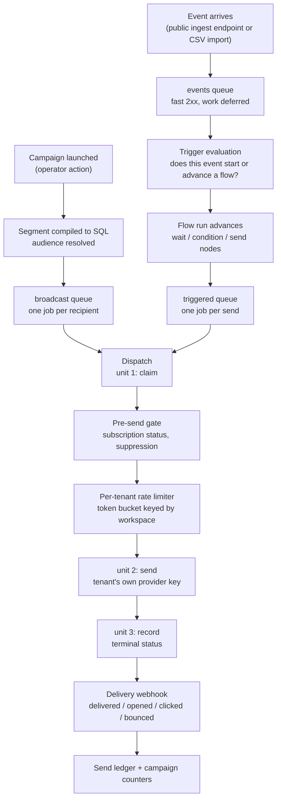

# Architecture

Three documents, three jobs. Keeping them apart is what stops any of them from rotting:

| Document | Answers | Contains |
|---|---|---|
| [`SPECIFICATION.md`](./SPECIFICATION.md) | **what is** | as-built facts: dependencies and versions, the schema and its RLS policies, secret storage, the send pipeline, every public entry point |
| **this file** | **why it is that way** | the load-bearing decisions and what they cost |
| [`CONVENTIONS.md`](./CONVENTIONS.md) | **how to write more of it** | naming, module shape, test patterns, migration rules |

This document deliberately restates no package version, table name, column name or environment-variable name. Where a fact is needed it links to the `SPECIFICATION.md` section that holds it. A duplicated fact drifts, and the duplicate is always the copy that goes stale.

---

## 1. The `apps/*` ↔ `packages/*` boundary

Domain logic lives in `packages/*`. Transport and process concerns live in `apps/*`. An HTTP route knows how to parse a request, resolve the caller's membership and map an error to a status code; it does not know how a segment compiles to SQL or when a send is allowed. That split is what lets `apps/api` and `apps/worker` — two separate OS processes with no import path between them — apply exactly the same rules to the same data.

**The dependency arrow points app → package and never back.** Every `apps/*` manifest lists `@mega-crm/*` packages; no `packages/*` manifest lists an app. That is not stylistic. `apps/*` workspaces declare no export entry points, so an inverted arrow would require adding one, and the moment a package can reach into an app, "shared domain logic" becomes "whatever the app happened to export".

The rule has already changed a design in practice. The SIGKILL failure-injection harness needs a child process running the real dispatch path, which lives in `apps/worker`. Rather than invert the arrow, the generic spawn/IPC/kill orchestration went into `packages/test-support` — naming no domain concept at all, asserted by a source check — and the worker-specific entrypoint stayed in `apps/worker`, handed to it by path. The constraint produced a cleaner separation than the shortcut would have.

Topology and the package inventory: [`SPECIFICATION.md` §1](./SPECIFICATION.md).

## 2. From an ingested event to a delivered email

This is the product's centre, and the one flow that gets a diagram. Everything else here is prose, because every diagram is another surface to update on every architectural change — which is the rot the documentation-update rule exists to prevent.

The dispatch step is three units on purpose, and the boundaries between them are where the failure modes live. Unit 1 commits a claim in its own transaction **before** the provider is contacted, so a redelivery cannot produce a second email. Unit 2 makes the call. Unit 3 records the terminal result. A process that dies between units 1 and 3 leaves a claim with no result, and the next delivery of that job takes an `interrupted` branch that resolves the row rather than sending again — the duplicate-send window, closed deliberately and reproducible on demand via the scenarios in [`docs/failure-injection-scenarios.md`](./docs/failure-injection-scenarios.md).

Queue names, worker registrations and the dispatcher's internals: [`SPECIFICATION.md` §5](./SPECIFICATION.md).

## 3. Two send queues, not one queue with priorities

Broadcast sends and triggered sends are **separate queues with separate workers**, deliberately, rather than one queue with job priorities.

Priority only resolves contention *within* a single worker pool. Put both kinds of work in one queue and a broadcast to a large audience monopolises every worker in that pool; a triggered send — a password reset, an order confirmation, the emails whose latency a recipient actually notices — waits behind however many broadcast jobs happen to be ahead of it. Priority reorders the queue, but the workers are already busy. Separate pools mean the triggered lane has workers of its own that a broadcast cannot occupy.

The cost is two topologies to operate instead of one, and concurrency that must be tuned per lane rather than globally. That is the trade being made.

The per-tenant rate limiter sits *below* both lanes, on a shared token bucket keyed by workspace, because the ceiling being respected belongs to the tenant's own provider account and does not care which lane a send came from.

## 4. Multi-tenancy: shared schema, tenant column, Row-Level Security

Every tenant's rows live in the same tables, discriminated by a workspace column, with Postgres Row-Level Security enforcing the boundary.

The alternatives were considered and rejected on scale. Schema-per-tenant multiplies catalog entries and turns every migration into a fan-out across N schemas; database-per-tenant multiplies connection management and migration orchestration on top of that. Both buy stronger physical isolation at a cost that grows linearly with tenant count, and this product's target is many tenants, not a few large ones.

**RLS is defence in depth, not the only defence.** Application code filters by workspace as well. The policies exist because relying on every engineer remembering the filter on every query, forever, is a single forgotten `WHERE` away from a cross-tenant leak. The session variable that the policies read is set with transaction scope, never session scope — a session-scoped setting would persist on a pooled connection and leak into whatever request picked it up next.

**The application role must never hold the bypass privilege.** RLS is also `FORCE`d, because a table's owner is otherwise exempt from its own policies and the application role owns these tables. Both properties are asserted directly by the migration-chain tests rather than assumed.

Policy shapes, the exact GUC, the tables without RLS and the known divergence between two policy variants: [`SPECIFICATION.md` §4.3](./SPECIFICATION.md).

## 5. Envelope encryption for tenant provider keys

Each tenant brings their own email-provider API key. That key controls their sending reputation, and it is the highest-value secret this platform holds.

It is protected by **envelope encryption**: a per-tenant data key encrypts the secret, and a key-encryption key wraps the data key. Only the wrapped data key and the ciphertext are stored.

The alternative — column encryption with a key the database can reach — fails the threat it exists to address. If the encryption key lives inside the same trust boundary as the ciphertext, a database compromise yields both, and the encryption bought nothing. Under envelope encryption the same compromise yields wrapped data keys the attacker cannot unwrap without the key-encryption key, which lives outside the database.

The tenant identity is bound into the wrap as additional authenticated data, so a payload sealed for one workspace does not decrypt under another's identity even with the key-encryption key in hand. The plaintext data key is zeroed immediately after use and never returned to a caller.

Provider selection, key storage and the local development path: [`SPECIFICATION.md` §3.4](./SPECIFICATION.md).

## 6. Partition maintenance and the dead-man's switch

`events` and `send_events` are range-partitioned by month, with a DEFAULT catch-all absorbing anything outside every partition explicitly created so far. A missing month is not a correctness failure — Postgres routes the row into DEFAULT and the insert succeeds — but it is a performance cliff waiting to happen: attaching a new monthly partition against a DEFAULT that has already absorbed real rows for that month forces Postgres to scan the entire DEFAULT partition under an `ACCESS EXCLUSIVE` lock to validate the attach, and on a live multi-tenant table that lock is felt by every tenant at once, not just the one whose data triggered it. The horizon has to stay ahead of the calendar precisely so that attach is never asked to do that scan.

Keeping the horizon ahead is one idempotent function's job, not a scattered set of call sites. `ensurePartitions` (`packages/db/src/partitions/ensure-partitions.ts`) is the single source of partition DDL for both tables, and every attach it performs goes through the same CHECK-constraint-first sequence unconditionally — add the constraint `NOT VALID`, validate it, attach, drop the now-redundant constraint — so a partition that already holds rows (the DEFAULT-relocation case) and a partition that has never held a row (the everyday case) are handled by exactly one code path (`attachPartitionCheckFirst`), not two that can drift apart. That function is called from three places: the daily worker tick, the same worker's boot-time immediate run (so a restart doesn't wait up to 24 hours to notice a gap), and the ephemeral-database test fixture — which is what makes "the tests pass" and "the horizon is actually maintained in production" the same claim instead of two that can diverge.

Attaching a NON-EMPTY child — only the DEFAULT-relocation procedure does this, never the everyday new-month case — needs one more piece: PostgreSQL automatically re-validates a partitioned table's inherited foreign keys against the referenced table when the attached child already holds rows, and `events.contact_id -> contacts(id)` / `send_events.send_id -> sends(id)` both reference tables under FORCE ROW LEVEL SECURITY. Through Phase 9 this used a session marker GUC (`app.admin_scan`) read by a permissive policy; Phase 10 (§7 below) retires that pattern everywhere, including here. The replacement is an explicit, optional `adminClient` parameter on `attachPartitionCheckFirst`: a connection backed by a Postgres role capable of bypassing row-level security (BYPASSRLS or superuser), supplied only by the operator-invoked relocation CLI (`packages/db/scripts/relocate-default-partition-rows.ts`, via `PARTITION_RELOCATION_ADMIN_DATABASE_URL`) and never by `apps/api` or `apps/worker`. The everyday `ensurePartitions` call path never supplies it — an empty child's FK re-validation trivially passes regardless of visibility, so the ordinary connection is sufficient there.

Whether that horizon is actually being maintained is answered by a two-process arrangement, not a self-report. The worker writes one row to Postgres (`partition_maintenance_runs`) every time it runs: how many months of buffer remain per table, whether either DEFAULT partition holds rows, and when the run happened. A separate process — inside `apps/api`, not inside `apps/worker` — polls that row on its own schedule and decides whether it looks healthy. This split is deliberate, not incidental: a watcher that lives inside the process it is watching cannot report that the process has stopped, because the watcher stops with it. Postgres is the only state shared between the two processes; there is no in-memory handoff, no direct RPC from worker to API. Sharing anything richer than a row in a table would reintroduce the coupling the split exists to remove — if the watchdog needed a live connection to the worker to ask "are you alive", the answer to "the worker crashed" would be silence indistinguishable from "everything is fine and quiet."

This arrangement is designed to make three failures loud, through one plain-text email to a platform operator: the maintenance job stopped running, the horizon is shrinking toward the calendar, and DEFAULT has started holding rows despite the horizon logic. It is not designed to provide dashboards, queue-depth alerting, or error aggregation — a failed maintenance run sits inspectable in Redis with no UI watching it, and turning that into real observability tooling is Phase 15's job, not this one's.

Queue name, cron schedule, the health-table columns, and the exact alert thresholds: [`SPECIFICATION.md` §4.4, §5.8, §7](./SPECIFICATION.md).

## 7. Cross-tenant scans run as a separate login role, not a session flag

A background job that must read across every tenant (campaign-scheduler's due-campaign discovery today; four more consumers in later plans of this phase) needs a genuine exception to Row-Level Security. Two shapes were considered for that exception, and the one this codebase used through Phase 9 — a session GUC (`app.admin_scan`) read by a permissive policy — was rejected going forward in favour of a dedicated, least-privilege Postgres login role (`mega_crm_scan`) reached through its own connection pool.

**Decision:** a separate pool connecting under its own login credential (`mega_crm_scan` — `NOBYPASSRLS`, owns no tables, holds only the grants each consumer's migration adds), reached through exactly one shared helper (`withCrossWorkspaceScan`, next to `withTenantTransaction`). The credential's DSN is a worker-process-only environment variable; the API's env schema never declares it. That absence is not a convention to remember — it is the proof: a process whose schema doesn't declare the variable cannot construct the pool, and `withCrossWorkspaceScan`'s pool is built lazily from that variable, so merely importing the package from the API process constructs nothing.

**Rejected: `SET LOCAL ROLE` on the existing tenant pool.** Switching role for the duration of a scan, on the same connection everything else uses, would have reused infrastructure instead of adding a second pool. It was rejected because it requires `GRANT mega_crm_scan TO mega_crm_app` — and the API connects as `mega_crm_app`. Granting the membership needed to make `SET LOCAL ROLE` work on the worker's pool would, by construction, also make it available to the API's identical login role. The claim this design exists to make provable — "the API process holds neither the scan role's credentials nor membership in it" — becomes false the moment that grant exists anywhere in the cluster, regardless of whether the API's code path ever exercises it.

**Rejected: keeping the session-flag GUC, with narrower policies.** The GUC pattern's actual weakness was never the policy predicates (those were already narrowable) — it was that any code holding the tenant pool can execute `SET`. The GUC is a convention enforced by code review, not an identity the database itself distinguishes. A login role is enforced by the connection handshake; nothing at the SQL layer can forge it.

**Reversibility:** costly. Four consumers in this phase adopt this exact shape (campaign-scheduler, flow-segment-sweep, flow-reconciliation, and analytics-reconciliation), and Phase 11's reconciler and Phase 12's sweep adopt it too. Changing the shape later means re-touching every consumer and the negative-test suite that proves the API cannot reach the role.

**The one consumer that could not adopt this shape: DEFAULT-partition relocation.** The scan role's whole design rests on owning no tables — an acceptance criterion of this phase, not an incidental property — but the DEFAULT-relocation procedure's ATTACH step issues `ALTER TABLE ... ATTACH PARTITION`, which Postgres requires table ownership to run. Granting the scan role that ownership, or membership in the owning role, would defeat the boundary this whole design exists to build; `mega_crm_scan` cannot be the answer for this one call site. Three shapes were considered at the plan 10-06 checkpoint: (a) restructure relocation to always attach an empty child and move rows afterward through the ordinary tenant-scoped path; (b) an operator-only elevated DSN, held only by the relocation CLI, for the ATTACH step specifically; (c) keep one marker-gated policy on `contacts`/`sends`, scoped to the app role. Option (b) was chosen: it keeps Phase 9's UAT'd build-then-attach operator procedure unchanged, and the elevated credential is held by no long-running service — the CLI is already operator-invoked and already builds its own dedicated pool, so a second, RLS-bypassing pool for this one step is a natural fit, not a new class of always-on risk. The credential is a real, documented bypass capability (Pitfall 9's warning applies), which is exactly why it is scoped this narrowly: one CLI script, one env var never declared in any service's schema, structurally asserted absent from `apps/api/src` and `apps/worker/src`.

Role attributes, the grant/policy matrix per table, the migration that first wires it, and the DEFAULT-relocation elevated-DSN credential: [`SPECIFICATION.md` §3, §4.3](./SPECIFICATION.md).

---

## Forward-looking — not yet true

Everything above describes code in this repository today. The items below do not exist yet and are named with the phase that introduces them, so nothing here can be mistaken for a description of the current system.

- **Phase 10 — RLS unification.** Two policy variants exist, and one of them errors rather than returning zero rows when no tenant is in scope on a recycled connection. Unifying them must go in the fail-closed direction. The current behaviour of both is pinned by tests in `packages/tenant-context` labelled as a pre-change baseline.
- **Phase 10 — the Better Auth trust boundary.** The `app.admin_scan` GUC pattern itself is fully retired as of plan 10-06 — every consumer named in §7 (campaign-scheduler, flow-segment-sweep, flow-reconciliation, analytics-reconciliation) reads through `mega_crm_scan`/`withCrossWorkspaceScan`, DEFAULT-partition relocation reads through its own operator-only elevated DSN, and migration 0043 drops the last policies that referenced the marker. What remains open: the `mega_crm_auth` role is created but not yet granted anything.
- **Phase 11 — the delivery state machine.** Dispatch has no timeout mechanism, so a timeout and a connection reset are indistinguishable to it today, and both resolve to a terminal failure. A reconciling state is planned. Three assertions encode the current terminal outcome and are listed by name in [`docs/failure-injection-scenarios.md`](./docs/failure-injection-scenarios.md).
- **Phase 12 — worker reliability.** Per-tenant concurrency caps, queue retention policy, and the queue's behaviour when its backing store reaches its memory ceiling.
- **Phase 14–15 — deployment.** There is no container image, no deployment manifest and no application health endpoint. How the processes are built and run outside a developer machine is undefined.
