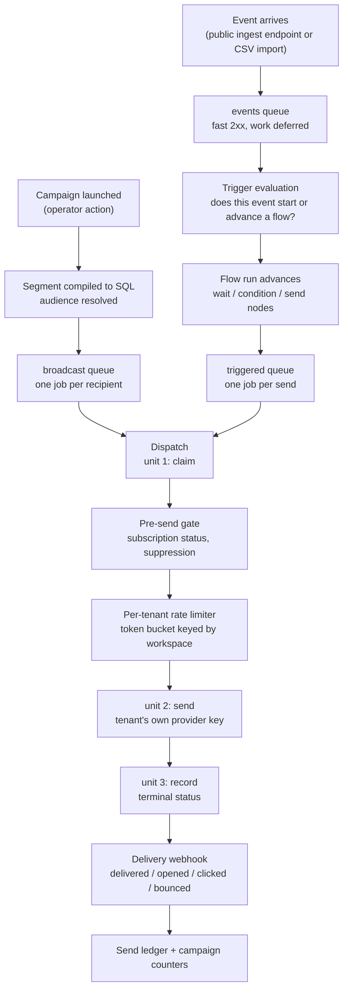

# Architecture

Three documents, three jobs. Keeping them apart is what stops any of them from rotting:

| Document | Answers | Contains |
|---|---|---|
| [`SPECIFICATION.md`](./SPECIFICATION.md) | **what is** | as-built facts: dependencies and versions, the schema and its RLS policies, secret storage, the send pipeline, every public entry point |
| **this file** | **why it is that way** | the load-bearing decisions and what they cost |
| [`CONVENTIONS.md`](./CONVENTIONS.md) | **how to write more of it** | naming, module shape, test patterns, migration rules |

This document deliberately restates no package version, table name, column name or environment-variable name. Where a fact is needed it links to the `SPECIFICATION.md` section that holds it. A duplicated fact drifts, and the duplicate is always the copy that goes stale.

---

## 1. The `apps/*` ↔ `packages/*` boundary

Domain logic lives in `packages/*`. Transport and process concerns live in `apps/*`. An HTTP route knows how to parse a request, resolve the caller's membership and map an error to a status code; it does not know how a segment compiles to SQL or when a send is allowed. That split is what lets `apps/api` and `apps/worker` — two separate OS processes with no import path between them — apply exactly the same rules to the same data.

**The dependency arrow points app → package and never back.** Every `apps/*` manifest lists `@mega-crm/*` packages; no `packages/*` manifest lists an app. That is not stylistic. `apps/*` workspaces declare no export entry points, so an inverted arrow would require adding one, and the moment a package can reach into an app, "shared domain logic" becomes "whatever the app happened to export".

The rule has already changed a design in practice. The SIGKILL failure-injection harness needs a child process running the real dispatch path, which lives in `apps/worker`. Rather than invert the arrow, the generic spawn/IPC/kill orchestration went into `packages/test-support` — naming no domain concept at all, asserted by a source check — and the worker-specific entrypoint stayed in `apps/worker`, handed to it by path. The constraint produced a cleaner separation than the shortcut would have.

Topology and the package inventory: [`SPECIFICATION.md` §1](./SPECIFICATION.md).

## 2. From an ingested event to a delivered email

This is the product's centre, and the one flow that gets a diagram. Everything else here is prose, because every diagram is another surface to update on every architectural change — which is the rot the documentation-update rule exists to prevent.

The dispatch step is three units on purpose, and the boundaries between them are where the failure modes live. Unit 1 commits a claim in its own transaction **before** the provider is contacted, so a redelivery cannot produce a second email. Unit 2 makes the call. Unit 3 records the terminal result. A process that dies between units 1 and 3 leaves a claim with no result, and the next delivery of that job takes an `interrupted` branch that resolves the row rather than sending again — the duplicate-send window, closed deliberately and reproducible on demand via the scenarios in [`docs/failure-injection-scenarios.md`](./docs/failure-injection-scenarios.md).

Queue names, worker registrations and the dispatcher's internals: [`SPECIFICATION.md` §5](./SPECIFICATION.md).

## 3. Two send queues, not one queue with priorities

Broadcast sends and triggered sends are **separate queues with separate workers**, deliberately, rather than one queue with job priorities.

Priority only resolves contention *within* a single worker pool. Put both kinds of work in one queue and a broadcast to a large audience monopolises every worker in that pool; a triggered send — a password reset, an order confirmation, the emails whose latency a recipient actually notices — waits behind however many broadcast jobs happen to be ahead of it. Priority reorders the queue, but the workers are already busy. Separate pools mean the triggered lane has workers of its own that a broadcast cannot occupy.

The cost is two topologies to operate instead of one, and concurrency that must be tuned per lane rather than globally. That is the trade being made.

The per-tenant rate limiter sits *below* both lanes, on a shared token bucket keyed by workspace, because the ceiling being respected belongs to the tenant's own provider account and does not care which lane a send came from.

## 4. Multi-tenancy: shared schema, tenant column, Row-Level Security

Every tenant's rows live in the same tables, discriminated by a workspace column, with Postgres Row-Level Security enforcing the boundary.

The alternatives were considered and rejected on scale. Schema-per-tenant multiplies catalog entries and turns every migration into a fan-out across N schemas; database-per-tenant multiplies connection management and migration orchestration on top of that. Both buy stronger physical isolation at a cost that grows linearly with tenant count, and this product's target is many tenants, not a few large ones.

**RLS is defence in depth, not the only defence.** Application code filters by workspace as well. The policies exist because relying on every engineer remembering the filter on every query, forever, is a single forgotten `WHERE` away from a cross-tenant leak. The session variable that the policies read is set with transaction scope, never session scope — a session-scoped setting would persist on a pooled connection and leak into whatever request picked it up next.

**The application role must never hold the bypass privilege.** RLS is also `FORCE`d, because a table's owner is otherwise exempt from its own policies and the application role owns these tables. Both properties are asserted directly by the migration-chain tests rather than assumed.

Policy shapes, the exact GUC, the tables without RLS and the known divergence between two policy variants: [`SPECIFICATION.md` §4.3](./SPECIFICATION.md).

## 5. Envelope encryption for tenant provider keys

Each tenant brings their own email-provider API key. That key controls their sending reputation, and it is the highest-value secret this platform holds.

It is protected by **envelope encryption**: a per-tenant data key encrypts the secret, and a key-encryption key wraps the data key. Only the wrapped data key and the ciphertext are stored.

The alternative — column encryption with a key the database can reach — fails the threat it exists to address. If the encryption key lives inside the same trust boundary as the ciphertext, a database compromise yields both, and the encryption bought nothing. Under envelope encryption the same compromise yields wrapped data keys the attacker cannot unwrap without the key-encryption key, which lives outside the database.

The tenant identity is bound into the wrap as additional authenticated data, so a payload sealed for one workspace does not decrypt under another's identity even with the key-encryption key in hand. The plaintext data key is zeroed immediately after use and never returned to a caller.

Provider selection, key storage and the local development path: [`SPECIFICATION.md` §3.4](./SPECIFICATION.md).

---

## Forward-looking — not yet true

Everything above describes code in this repository today. The items below do not exist yet and are named with the phase that introduces them, so nothing here can be mistaken for a description of the current system.

- **Phase 9 — partition growth.** The event and delivery-event tables are partitioned by time, but no code creates future partitions. Beyond the last explicitly created partition, rows land in the default partition indefinitely. The chain tests pin today's partition posture so that whatever automates this has a regression net.
- **Phase 10 — RLS unification.** Two policy variants exist, and one of them errors rather than returning zero rows when no tenant is in scope on a recycled connection. Unifying them must go in the fail-closed direction. The current behaviour of both is pinned by tests in `packages/tenant-context` labelled as a pre-change baseline.
- **Phase 11 — the delivery state machine.** Dispatch has no timeout mechanism, so a timeout and a connection reset are indistinguishable to it today, and both resolve to a terminal failure. A reconciling state is planned. Three assertions encode the current terminal outcome and are listed by name in [`docs/failure-injection-scenarios.md`](./docs/failure-injection-scenarios.md).
- **Phase 12 — worker reliability.** Per-tenant concurrency caps, queue retention policy, and the queue's behaviour when its backing store reaches its memory ceiling.
- **Phase 14–15 — deployment.** There is no container image, no deployment manifest and no application health endpoint. How the processes are built and run outside a developer machine is undefined.
