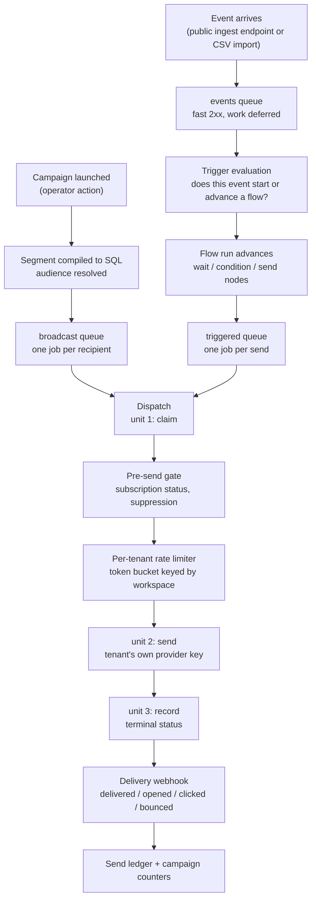
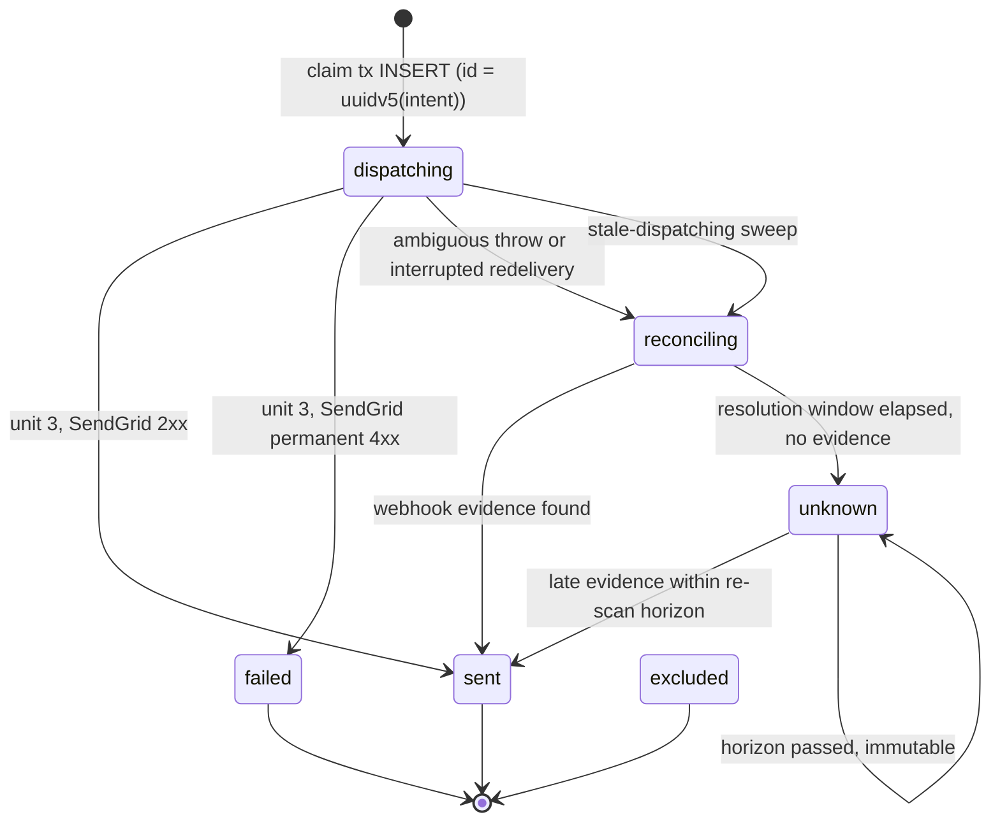

# Architecture

Three documents, three jobs. Keeping them apart is what stops any of them from rotting:

| Document | Answers | Contains |
|---|---|---|
| [`SPECIFICATION.md`](./SPECIFICATION.md) | **what is** | as-built facts: dependencies and versions, the schema and its RLS policies, secret storage, the send pipeline, every public entry point |
| **this file** | **why it is that way** | the load-bearing decisions and what they cost |
| [`CONVENTIONS.md`](./CONVENTIONS.md) | **how to write more of it** | naming, module shape, test patterns, migration rules |

This document deliberately restates no package version, table name, column name or environment-variable name. Where a fact is needed it links to the `SPECIFICATION.md` section that holds it. A duplicated fact drifts, and the duplicate is always the copy that goes stale.

---

## 1. The `apps/*` ↔ `packages/*` boundary

Domain logic lives in `packages/*`. Transport and process concerns live in `apps/*`. An HTTP route knows how to parse a request, resolve the caller's membership and map an error to a status code; it does not know how a segment compiles to SQL or when a send is allowed. That split is what lets `apps/api` and `apps/worker` — two separate OS processes with no import path between them — apply exactly the same rules to the same data.

**The dependency arrow points app → package and never back.** Every `apps/*` manifest lists `@mega-crm/*` packages; no `packages/*` manifest lists an app. That is not stylistic. `apps/*` workspaces declare no export entry points, so an inverted arrow would require adding one, and the moment a package can reach into an app, "shared domain logic" becomes "whatever the app happened to export".

The rule has already changed a design in practice. The SIGKILL failure-injection harness needs a child process running the real dispatch path, which lives in `apps/worker`. Rather than invert the arrow, the generic spawn/IPC/kill orchestration went into `packages/test-support` — naming no domain concept at all, asserted by a source check — and the worker-specific entrypoint stayed in `apps/worker`, handed to it by path. The constraint produced a cleaner separation than the shortcut would have.

Topology and the package inventory: [`SPECIFICATION.md` §1](./SPECIFICATION.md).

## 2. From an ingested event to a delivered email

This is the product's centre, and the one flow that gets a diagram. Everything else here is prose, because every diagram is another surface to update on every architectural change — which is the rot the documentation-update rule exists to prevent.

The dispatch step is three units on purpose, and the boundaries between them are where the failure modes live. Unit 1 commits a claim in its own transaction **before** the provider is contacted, so a redelivery cannot produce a second email. Unit 2 makes the call. Unit 3 records the terminal result. A process that dies between units 1 and 3 leaves a claim with no result, and the next delivery of that job takes an `interrupted` branch that resolves the row rather than sending again — the duplicate-send window, closed deliberately and reproducible on demand via the scenarios in [`docs/failure-injection-scenarios.md`](./docs/failure-injection-scenarios.md).

Queue names, worker registrations and the dispatcher's internals: [`SPECIFICATION.md` §5](./SPECIFICATION.md).

## 3. Two send queues, not one queue with priorities

Broadcast sends and triggered sends are **separate queues with separate workers**, deliberately, rather than one queue with job priorities.

Priority only resolves contention *within* a single worker pool. Put both kinds of work in one queue and a broadcast to a large audience monopolises every worker in that pool; a triggered send — a password reset, an order confirmation, the emails whose latency a recipient actually notices — waits behind however many broadcast jobs happen to be ahead of it. Priority reorders the queue, but the workers are already busy. Separate pools mean the triggered lane has workers of its own that a broadcast cannot occupy.

The cost is two topologies to operate instead of one, and concurrency that must be tuned per lane rather than globally. That is the trade being made.

The per-tenant rate limiter sits *below* both lanes, on a shared token bucket keyed by workspace, because the ceiling being respected belongs to the tenant's own provider account and does not care which lane a send came from.

## 4. Multi-tenancy: shared schema, tenant column, Row-Level Security

Every tenant's rows live in the same tables, discriminated by a workspace column, with Postgres Row-Level Security enforcing the boundary.

The alternatives were considered and rejected on scale. Schema-per-tenant multiplies catalog entries and turns every migration into a fan-out across N schemas; database-per-tenant multiplies connection management and migration orchestration on top of that. Both buy stronger physical isolation at a cost that grows linearly with tenant count, and this product's target is many tenants, not a few large ones.

**RLS is defence in depth, not the only defence.** Application code filters by workspace as well. The policies exist because relying on every engineer remembering the filter on every query, forever, is a single forgotten `WHERE` away from a cross-tenant leak. The session variable that the policies read is set with transaction scope, never session scope — a session-scoped setting would persist on a pooled connection and leak into whatever request picked it up next.

**The application role must never hold the bypass privilege.** RLS is also `FORCE`d, because a table's owner is otherwise exempt from its own policies and the application role owns these tables. Both properties are asserted directly by the migration-chain tests rather than assumed.

Policy shapes, the exact GUC, the tables without RLS and the known divergence between two policy variants: [`SPECIFICATION.md` §4.3](./SPECIFICATION.md).

## 5. Envelope encryption for tenant provider keys

Each tenant brings their own email-provider API key. That key controls their sending reputation, and it is the highest-value secret this platform holds.

It is protected by **envelope encryption**: a per-tenant data key encrypts the secret, and a key-encryption key wraps the data key. Only the wrapped data key and the ciphertext are stored.

The alternative — column encryption with a key the database can reach — fails the threat it exists to address. If the encryption key lives inside the same trust boundary as the ciphertext, a database compromise yields both, and the encryption bought nothing. Under envelope encryption the same compromise yields wrapped data keys the attacker cannot unwrap without the key-encryption key, which lives outside the database.

The tenant identity is bound into the wrap as additional authenticated data, so a payload sealed for one workspace does not decrypt under another's identity even with the key-encryption key in hand. The plaintext data key is zeroed immediately after use and never returned to a caller.

Provider selection, key storage and the local development path: [`SPECIFICATION.md` §3.4](./SPECIFICATION.md).

## 6. Partition maintenance and the dead-man's switch

`events` and `send_events` are range-partitioned by month, with a DEFAULT catch-all absorbing anything outside every partition explicitly created so far. A missing month is not a correctness failure — Postgres routes the row into DEFAULT and the insert succeeds — but it is a performance cliff waiting to happen: attaching a new monthly partition against a DEFAULT that has already absorbed real rows for that month forces Postgres to scan the entire DEFAULT partition under an `ACCESS EXCLUSIVE` lock to validate the attach, and on a live multi-tenant table that lock is felt by every tenant at once, not just the one whose data triggered it. The horizon has to stay ahead of the calendar precisely so that attach is never asked to do that scan.

Keeping the horizon ahead is one idempotent function's job, not a scattered set of call sites. `ensurePartitions` (`packages/db/src/partitions/ensure-partitions.ts`) is the single source of partition DDL for both tables, and every attach it performs goes through the same CHECK-constraint-first sequence unconditionally — add the constraint `NOT VALID`, validate it, attach, drop the now-redundant constraint — so a partition that already holds rows (the DEFAULT-relocation case) and a partition that has never held a row (the everyday case) are handled by exactly one code path (`attachPartitionCheckFirst`), not two that can drift apart. That function is called from three places: the daily worker tick, the same worker's boot-time immediate run (so a restart doesn't wait up to 24 hours to notice a gap), and the ephemeral-database test fixture — which is what makes "the tests pass" and "the horizon is actually maintained in production" the same claim instead of two that can diverge.

Attaching a NON-EMPTY child — only the DEFAULT-relocation procedure does this, never the everyday new-month case — needs one more piece: PostgreSQL automatically re-validates a partitioned table's inherited foreign keys against the referenced table when the attached child already holds rows, and `events.contact_id -> contacts(id)` / `send_events.send_id -> sends(id)` both reference tables under FORCE ROW LEVEL SECURITY. Through Phase 9 this used a session marker GUC (`app.admin_scan`) read by a permissive policy; Phase 10 (§7 below) retires that pattern everywhere, including here. The replacement is an explicit, optional `adminClient` parameter on `attachPartitionCheckFirst`: a connection backed by a Postgres role capable of bypassing row-level security (BYPASSRLS or superuser), supplied only by the operator-invoked relocation CLI (`packages/db/scripts/relocate-default-partition-rows.ts`, via `PARTITION_RELOCATION_ADMIN_DATABASE_URL`) and never by `apps/api` or `apps/worker`. The everyday `ensurePartitions` call path never supplies it — an empty child's FK re-validation trivially passes regardless of visibility, so the ordinary connection is sufficient there.

Whether that horizon is actually being maintained is answered by a two-process arrangement, not a self-report. The worker writes one row to Postgres (`partition_maintenance_runs`) every time it runs: how many months of buffer remain per table, whether either DEFAULT partition holds rows, and when the run happened. A separate process — inside `apps/api`, not inside `apps/worker` — polls that row on its own schedule and decides whether it looks healthy. This split is deliberate, not incidental: a watcher that lives inside the process it is watching cannot report that the process has stopped, because the watcher stops with it. Postgres is the only state shared between the two processes; there is no in-memory handoff, no direct RPC from worker to API. Sharing anything richer than a row in a table would reintroduce the coupling the split exists to remove — if the watchdog needed a live connection to the worker to ask "are you alive", the answer to "the worker crashed" would be silence indistinguishable from "everything is fine and quiet."

This arrangement is designed to make three failures loud, through one plain-text email to a platform operator: the maintenance job stopped running, the horizon is shrinking toward the calendar, and DEFAULT has started holding rows despite the horizon logic. It is not designed to provide dashboards, queue-depth alerting, or error aggregation — a failed maintenance run sits inspectable in Redis with no UI watching it, and turning that into real observability tooling is Phase 15's job, not this one's.

Queue name, cron schedule, the health-table columns, and the exact alert thresholds: [`SPECIFICATION.md` §4.4, §5.8, §7](./SPECIFICATION.md).

## 7. Cross-tenant scans run as a separate login role, not a session flag

A background job that must read across every tenant (campaign-scheduler's due-campaign discovery today; four more consumers in later plans of this phase) needs a genuine exception to Row-Level Security. Two shapes were considered for that exception, and the one this codebase used through Phase 9 — a session GUC (`app.admin_scan`) read by a permissive policy — was rejected going forward in favour of a dedicated, least-privilege Postgres login role (`mega_crm_scan`) reached through its own connection pool.

**Decision:** a separate pool connecting under its own login credential (`mega_crm_scan` — `NOBYPASSRLS`, owns no tables, holds only the grants each consumer's migration adds), reached through exactly one shared helper (`withCrossWorkspaceScan`, next to `withTenantTransaction`). The credential's DSN is a worker-process-only environment variable; the API's env schema never declares it. That absence is not a convention to remember — it is the proof: a process whose schema doesn't declare the variable cannot construct the pool, and `withCrossWorkspaceScan`'s pool is built lazily from that variable, so merely importing the package from the API process constructs nothing.

**Rejected: `SET LOCAL ROLE` on the existing tenant pool.** Switching role for the duration of a scan, on the same connection everything else uses, would have reused infrastructure instead of adding a second pool. It was rejected because it requires `GRANT mega_crm_scan TO mega_crm_app` — and the API connects as `mega_crm_app`. Granting the membership needed to make `SET LOCAL ROLE` work on the worker's pool would, by construction, also make it available to the API's identical login role. The claim this design exists to make provable — "the API process holds neither the scan role's credentials nor membership in it" — becomes false the moment that grant exists anywhere in the cluster, regardless of whether the API's code path ever exercises it.

**Rejected: keeping the session-flag GUC, with narrower policies.** The GUC pattern's actual weakness was never the policy predicates (those were already narrowable) — it was that any code holding the tenant pool can execute `SET`. The GUC is a convention enforced by code review, not an identity the database itself distinguishes. A login role is enforced by the connection handshake; nothing at the SQL layer can forge it.

**Reversibility:** costly. Four consumers in this phase adopt this exact shape (campaign-scheduler, flow-segment-sweep, flow-reconciliation, and analytics-reconciliation), and Phase 11's reconciler and Phase 12's sweep adopt it too. Changing the shape later means re-touching every consumer and the negative-test suite that proves the API cannot reach the role.

**The one consumer that could not adopt this shape: DEFAULT-partition relocation.** The scan role's whole design rests on owning no tables — an acceptance criterion of this phase, not an incidental property — but the DEFAULT-relocation procedure's ATTACH step issues `ALTER TABLE ... ATTACH PARTITION`, which Postgres requires table ownership to run. Granting the scan role that ownership, or membership in the owning role, would defeat the boundary this whole design exists to build; `mega_crm_scan` cannot be the answer for this one call site. Three shapes were considered at the plan 10-06 checkpoint: (a) restructure relocation to always attach an empty child and move rows afterward through the ordinary tenant-scoped path; (b) an operator-only elevated DSN, held only by the relocation CLI, for the ATTACH step specifically; (c) keep one marker-gated policy on `contacts`/`sends`, scoped to the app role. Option (b) was chosen: it keeps Phase 9's UAT'd build-then-attach operator procedure unchanged, and the elevated credential is held by no long-running service — the CLI is already operator-invoked and already builds its own dedicated pool, so a second, RLS-bypassing pool for this one step is a natural fit, not a new class of always-on risk. The credential is a real, documented bypass capability (Pitfall 9's warning applies), which is exactly why it is scoped this narrowly: one CLI script, one env var never declared in any service's schema, structurally asserted absent from `apps/api/src` and `apps/worker/src`.

Role attributes, the grant/policy matrix per table, the migration that first wires it, and the DEFAULT-relocation elevated-DSN credential: [`SPECIFICATION.md` §3, §4.3](./SPECIFICATION.md).

---

## 8. The Better Auth tables sit behind their own login role

Better Auth's seven tables (`user`, `session`, `account`, `verification`, `organization`, `member`, `invitation`) carry no Row-Level Security at all — the same non-tenant Drizzle pool that resolves a workspace slug historically also served every one of Better Auth's own reads and writes, connecting as `mega_crm_app`, the same role every tenant-scoped query runs as. `session.token`, `account.password` and `verification.value` are the highest-value secret-bearing rows in the database after a tenant's SendGrid key, and until this plan they were reachable by any query issued through that pool.

**Decision:** a dedicated `mega_crm_auth` login role, reached through its own connection pool (`authDb`, built from its own `AUTH_DATABASE_URL`), holding exclusive `SELECT, INSERT, UPDATE, DELETE` on all seven tables. `mega_crm_app` is revoked entirely from `session`, `account` and `verification`; it keeps `SELECT` on the four workspace-shaped tables (`organization`, `member`, `invitation`, `user`) plus `UPDATE` on `organization`, matched exactly to the live query sites `workspace-lookup.ts`, `workspaces.ts`, `invites.ts` and `members.ts` genuinely use outside Better Auth's own adapter. `organization.id` is the value every one of the 22 tenant `workspace_id` columns FKs to and every `workspace_isolation` RLS policy casts against — that is why the four workspace-shaped tables stay app-readable rather than moving behind the boundary wholesale, while the three genuinely secret-bearing tables do not.

**Rejected: row-level security on the auth tables.** Better Auth's adapter sets no session GUC (unlike the tenant pool's `app.current_workspace_id`), so a policy on these tables could only key on connection role — which a `GRANT`/`REVOKE` partition expresses more directly, without adding a policy layer that does the same job worse. The concrete cost of getting this wrong is Pitfall 12: a naive RLS policy copy-pasted onto these tables returns **zero rows** to every Better Auth query, with no SQL error — signup, login and session validation all break platform-wide, silently, because Better Auth's own code has no reason to suspect the rows it wrote are being filtered back out of its own reads.

**Rejected: moving the seven tables into a separate `auth.*` schema.** The alternative boundary shape — `REVOKE ALL ON SCHEMA auth FROM mega_crm_app` instead of seven table-level revokes — was considered and rejected because `organization` is the FK target of all 22 tenant tables plus `member` and `invitation`; moving it (and its six siblings) to a new schema is the highest-risk migration available for the same end state, touching every foreign key in the schema for a boundary a grant partition achieves without moving a single table.

**Reversibility:** one-way. Grant revocations ship as forward-only migrations under DB-07's rollback model — undoing them means writing and shipping another migration, not rolling back this one. The acceptance gate is the auth-flow end-to-end suite (`apps/api/src/modules/auth/__tests__/auth-boundary.test.ts`): signup, login and invite-accept all run against the real server and the real database, never a mock, because Pitfall 12's failure mode is precisely the kind a mock cannot surface.

**The checkpoint-accepted caveat: `mega_crm_app` owns all seven tables, and an owner can always `GRANT` itself back in.** Table ownership did not move as part of this migration — moving it was considered at the plan 10-09 checkpoint (option-c) and rejected, because migrations apply as `mega_crm_app`, and an owner-less `mega_crm_app` would be unable to alter these tables without a privileged out-of-band step for every future Better Auth schema change. The checkpoint selected option-a (ship the grant matrix as audited, accept the caveat) over option-c (move ownership, close the caveat, accept the migration-authoring cost) and option-b (also leave `mega_crm_app` with privileges on `verification` "just in case" — rejected as an unjustified weakening of a secret-bearing table's boundary with no live query site evidence behind it). This migration is therefore a boundary against an application bug or an injected query, not against an attacker who already controls a session running as the owning role — documented here rather than left implicit, per the checkpoint's own instruction.

**Execution-discovered addition, beyond the checkpoint's application-level audit:** Postgres enforces every foreign key referencing `user` (from `account`, `session`, `member`, `invitation`) with an internal row-locking check that runs under the *referencing* table's owner — `mega_crm_app` — regardless of which role's connection performs the insert. That check requires `SELECT` **and** `UPDATE` on `user`, not `SELECT` alone (verified empirically; a `REFERENCES`-only grant does not substitute for it). Migration 0045 grants `mega_crm_app` `UPDATE` on `user` and `REFERENCES` on `organization` for this reason alone — no first-party application source performs `UPDATE "user"` outside Better Auth's own `mega_crm_auth`-backed adapter, and the checkpoint's SELECT-only conclusion for `user` at the application layer is unchanged. Both grants exist purely to satisfy Postgres's own constraint-enforcement and DDL-authoring mechanisms, which a plan-time audit of `apps/api/src` query sites has no way to surface.

Grant matrix per table, `AUTH_DATABASE_URL`, and the `BETTER_AUTH_SECRET` production floor: [`SPECIFICATION.md` §3, §4.1, §4.3](./SPECIFICATION.md).

---

## 9. The send delivery state machine

Every row in `sends` moves through a small set of statuses, and this section names, for every transition, the single component allowed to write it. That matrix is reviewed here, before any code in `send-dispatch.ts` changes (Phase 11 D-18) — the alternative, deciding "who resolves this row" ad hoc inside three different files as each is edited, is exactly how the duplicate-write race this phase exists to close would reappear. `packages/delivery-core/src/send-state-machine.ts` is the executable mirror of everything below: the same six statuses, the same transitions, the same writers, expressed as a `satisfies Record<SendStatus, ...>` matrix so an undocumented status is a `npm run typecheck` failure rather than a drift nobody notices.

### Per-transition writer matrix

| From | To | Writer(s) | Trigger |
|---|---|---|---|
| `dispatching` | `sent` | send worker | unit 3, SendGrid 2xx response |
| `dispatching` | `failed` | send worker | unit 3, SendGrid permanent 4xx response |
| `dispatching` | `reconciling` | **send worker AND reconciler** | send worker: unit 3 ambiguous throw (timeout/`ECONNRESET`/fail-closed default) or interrupted redelivery (a prior claim survived with no terminal write); reconciler: stale-`dispatching` sweep (age exceeds the max-job-lifetime threshold, no interrupted detection ever ran) |
| `reconciling` | `sent` | reconciler | webhook evidence found in `send_events` for this `send_id` |
| `reconciling` | `unknown` | reconciler | resolution window (~24h) elapsed with no evidence |
| `unknown` | `sent` | reconciler | late evidence found within the re-scan horizon (~72h) |

`dispatching -> reconciling` is the only row with two writers, and it is deliberate, not an oversight: the send worker observes the ambiguous/interrupted case in-band, at the moment it happens; the reconciler observes the stale-age case out-of-band, on its own tick, for rows no worker ever came back to report on. Every other row above has exactly one writer, and every transition whose `From` column is `reconciling` or `unknown` has the reconciler as that sole writer — nothing else is permitted to move a row out of either state.

### Why the reconciler never writes `failed`

`failed` means "SendGrid synchronously rejected the send with a permanent 4xx" — a fact only the job processor can observe, at send time, because it is the one holding the live HTTP response. A webhook is asynchronous, positive-only evidence: SendGrid tells you what a message *did* do, and it has no event that proves a message was *never* accepted. Give the reconciler a `-> failed` transition and it would be asserting a fact it has no way to know. **No `reconciling -> failed` transition exists in this matrix, and none should ever be added** — the matrix above has exactly two terminal writes leaving `reconciling`/`unknown` — `-> sent` (evidence found) and `-> unknown` (resolution window elapsed) — and no third option.

### Delivery model (DLV-07)

The platform's guarantee is **at-most-once at the SendGrid-acceptance boundary**: it never knowingly re-sends a message it cannot prove SendGrid did not accept. Retries are **effectively-once** strictly before acceptance becomes ambiguous — a 429/5xx response or a provably pre-connection failure (DNS failure, connection refused) proves the request either never left the process or was explicitly not accepted, so it is always safe to retry those cases with a bounded backoff.

A send that resolves to `unknown` is a deliberate, honestly-scoped trade-off, not a bug: it **may have reached the recipient, and it may have been lost** — SendGrid may have accepted it with no surviving webhook evidence, or evidence may exist but never have arrived. The platform will **not** re-send it automatically. Recovering a specific `unknown` send is a documented manual operator action; no re-send tooling exists in this milestone. Nothing in this system should ever claim stronger than this — no "no mail is ever lost", no guarantee of a single delivery attempt per message end to end — because the reconciler's own design (classification-only, no SendGrid calls, D-01) makes that claim provably false: guaranteeing no duplicates and guaranteeing no loss are in tension at the acceptance boundary, and this platform chooses no-duplicates.

### The `unknown` horizon

`unknown` is a terminal state in the sense that nothing but the reconciler may ever write to it or out of it, but it is not immediately immutable. Each reconciler tick also re-examines `unknown` rows younger than a bounded **re-scan horizon** and upgrades `unknown -> sent` if evidence has since appeared — late-arriving webhooks are not lost just because the row already resolved to `unknown` once. Only after that horizon passes does an `unknown` row become fully immutable: no future tick will look at it again. The **resolution window** (`reconciling -> unknown`, ~24h) and the **re-scan horizon** (`unknown -> unknown`/`unknown -> sent`, ~72h) are named here as concepts rather than numbers on purpose — their versioned constants, with rationale comments, live in `packages/delivery-core/src/reconciler.ts`, and restating the numbers here would just be a second place for them to go stale.

### `excluded` rows, and why rollups skip `unknown`

Not every row in `sends` passes through `dispatching`. `recordExcluded`/`recordFlowExcluded` insert `excluded` rows directly for contacts that never reach the claim gate at all — suppressed, unsubscribed, or frequency-capped before any SendGrid attempt is ever made — which is why the diagram above shows `excluded` as its own terminal state with no incoming edge from `dispatching`. Daily rollups are computed from fact columns (`sent_at`, `delivered_at`, and siblings), never from `status` directly, which is also why an `unknown` row contributes to no rollup count: it has no fact column set, by definition, and a rollup built from facts has nothing to count it as.

---

## 10. Worker reliability: tenant fairness, drain budget, and multi-instance safety

### Tenant fairness

One tenant's send volume must never starve another tenant's, and neither ceiling may be confused with genuine SendGrid-wide backpressure. Two independent ceilings enforce this, keyed differently on purpose, both resolving to the SAME deferral path:

- **RPS ceiling** (`rate-limiter.ts`, keyed by `workspaceId` alone) — models the tenant's own SendGrid account rate limit. One ceiling per tenant regardless of which lane (broadcast/triggered) the send came from, because SendGrid enforces it against the tenant's single API key, not per queue.
- **Concurrency-cap ceiling** (`tenant-lane-semaphore.ts`, keyed by `workspaceId` + `lane`) — bounds how many of the worker's OWN slots one tenant can occupy at once, independently in each lane. Deliberately a different key than the RPS ceiling: the RPS ceiling models a fact about the tenant's provider account; the concurrency ceiling models a fact about this process's own finite slot pool, which is a per-lane resource, not a per-tenant-account one.

Both triggers — RPS exhausted, concurrency cap exhausted — return the SAME `{ outcome: "rate_limited", cause: "tenant_bucket" }` shape from `processSendJob`, and the worker wrapper defers that job via `job.moveToDelayed` + `DelayedError`, never `worker.rateLimit()`. This is the load-bearing distinction: `worker.rateLimit()` pauses the ENTIRE worker's draining for every tenant sharing that queue, which is exactly the WRK-01 bug this mechanism replaces. **Only genuine provider backpressure** (`cause: "provider_backoff"` — a SendGrid 429/5xx) may ever pause a worker via `worker.rateLimit()`; every tenant-scoped cause, no matter which of the two ceilings raised it, is deferred through the tenant-scoped path so every other tenant's jobs keep draining.

Facts and exact values: [`SPECIFICATION.md` §5.5](./SPECIFICATION.md).

### Drain budget

A job legitimately mid-dispatch when the process receives SIGTERM must be allowed to finish — killing it mid-flight produces exactly the ambiguous "SendGrid may have accepted it, the process died before recording it" scenario Phase 11's `reconciling` state and reconciler exist to resolve. Every occurrence still costs a resolution-window delay a correctly-sized grace period avoids outright.

`apps/worker/src/shutdown-budget.ts` derives the worker's own required stop-grace-period from the same constants the send-timing invariant already checks: the SendGrid call's own timeout, plus the claim and record transaction margins that surround it, plus an explicit safety margin covering a slow terminal write under load and ordinary scheduling jitter. The derivation is computed from imported constants, never hand-typed, so a future change to any input changes the published budget automatically instead of silently disagreeing with a stale number written down here.

**The container runtime's stop-grace-period MUST be set from this module's published value, never left at a runtime default.** Docker's unconfigured default (10s) is already shorter than the SendGrid call timeout alone, before either transaction margin is added. Phase 14 (deployment) is the consumer of this value — it configures the actual container/orchestrator setting; this module only derives and publishes the number, and does not itself configure anything.

Exact constants and their current value: [`SPECIFICATION.md` §5.1](./SPECIFICATION.md).

### Multi-instance safety — stated precisely, not overclaimed

`upsertJobScheduler`'s registration dedup is **schedule-registration idempotency, not execution exclusivity.** Calling it on every boot guarantees at most one *schedule entry* exists in Redis for a given scheduler id — it says nothing about how many worker *processes*, pointed at that same Redis, execute a given tick. Two worker processes sharing one Redis can both receive and execute the same tick.

**Single-instance worker deployment is therefore an explicit constraint of this milestone, not an emergent property of any registration mechanism used here.** Nothing in `apps/worker` provides cross-process execution exclusivity for a repeatable tick, and nothing should be assumed to. A future move to multi-instance worker deployment must add its own execution-exclusivity mechanism before that move is safe — `upsertJobScheduler` alone does not become that mechanism merely by continuing to be used.

This is more tolerable than it sounds for the ticks that already exist: several tick bodies (`campaign-scheduler`, `flow-reconciliation`, `send-reconciler`, `flow-segment-sweep`'s per-flow walk) already claim their rows exclusively at the data layer (`SELECT ... FOR UPDATE SKIP LOCKED`), which makes a duplicated tick a harmless no-op race for THOSE ticks specifically — but that per-row claim is a property of each tick's own body, not a property `upsertJobScheduler` grants, and a future tick author must not assume it comes for free.

---

## 11. The daily-metric day-semantics contract (CMP-02/CMP-03)

Every number in `workspace_daily_rollup` answers the same question — "how many of X happened on day D" — and this section is the single place that says what "day D" means, so it is stated once and referenced, not restated with a subtly different meaning every time a new counter is added. This contract has to agree word for word with the one written into `packages/db/src/schema/workspace-daily-rollup.ts`'s own doc comment, because that file is read by the engineers changing the write paths and this one is read by everyone else — two descriptions of the same rule is the exact failure this section exists to prevent.

**The contract:**

1. `day` is always a UTC calendar day, never a local or session-timezone day. Every day-bucketing cast forces `AT TIME ZONE 'UTC'` explicitly — a bare `::date` cast on a `timestamptz` converts through the session's `TimeZone` GUC first, which would otherwise make the same row report a different day depending on which pooled connection happened to serve the query.
2. `sent_count` is bucketed by `sends.sent_at` — the SendGrid-acceptance timestamp. The reconciliation worker is its sole writer; the incremental webhook-driven path never sets it, because a dispatched send produces no webhook event of its own to trigger an increment from.
3. Every event-derived counter (`delivered_count`, `opened_count`, `clicked_count`, `bounced_count`, `unsubscribed_count`) is bucketed by the provider event's own `occurred_at` UTC day on the incremental path, and by the corresponding `sends` fact column's UTC day on the reconciliation path. The two must agree, because reconciliation is an absolute overwrite of whatever the incremental path already wrote for that `(workspace, day)` — a disagreement here silently corrupts the number reconciliation was supposed to correct.
4. `unknown` sends are excluded from every rollup count. They get their own visible count instead, in campaign progress and send-log stats (plan 13-03) — a marketer reading "sent: 40, outcome unknown: 3" sees an honest accounting; folding those 3 silently into either `sent_count` or a failure count would assert something the platform does not know to be true.
5. An increment for any day other than today (UTC) marks that day's row dirty (`dirtied_at`, migration 0056) instead of trusting the incremental write alone. The next reconciliation tick re-verifies every dirty day against a fresh scan of `sends`, then clears the mark — but only if the mark predates the sweep's own start time, so a second late event arriving mid-sweep is never lost to an unconditional clear. Lateness is judged purely by UTC calendar day, independent of how wide the reconciler's own standing window happens to be — an event arriving in the last minute before UTC midnight is still caught, which a window-edge-relative predicate would have missed.

**One discontinuity worth naming plainly, because an unexplained step change in a dashboard series is exactly the kind of thing that gets investigated as a bug months later:** the public unsubscribe route started incrementing `workspace_daily_rollup.unsubscribed_count` as of plan 13-08 — it never did before, because the increment function was unreachable from `apps/api` until that plan relocated it into a package both applications import. Daily unsubscribe counts are higher from that plan's deploy date onward for the same underlying tenant behavior; nothing about how a marketer unsubscribes changed.

Exact column names, the reconciliation window, and the dirty-day sweep's page limit: [`SPECIFICATION.md` §4.2, §5.1](./SPECIFICATION.md).

## 12. The erasure-and-evidence model (CMP-04)

A contact-deletion request sits at the intersection of two obligations that pull in opposite directions: the right to have personal data erased, and the platform's own need to later prove a send or a suppression was lawful. A hard `DELETE` satisfies the first and destroys the second. This platform's answer is **anonymize in place, retain the evidence skeleton, scrub the linked PII asynchronously** — never a hard delete of the contact row, and never a permanent skip of the scrub.

**Synchronous, inside the delete request's own transaction:** the contact row is anonymized — every PII-bearing column nulled (or emptied, for the one `NOT NULL` array column), the row and every foreign key pointing at it left in place — subscription status and suppression are resolved immediately so mail to that address stops before the request even returns, an auditable erasure record is written proving the erasure happened and when, and a scrub job is queued. All four of these happen in the one transaction the delete request opens; nothing about "erasure happened" is left to a later, unobserved step.

**Asynchronous, bounded and resumable:** a scrub worker walks the linked partitioned tables in checkpointed pages and rewrites their JSONB payloads. The mechanism is allowlist reconstruction, never a denylist — one table's evidence-bearing column keeps only a small, explicitly named set of provider fields (the event type, the provider's own message and event ids, delivery status, and similar forensic-but-not-personal fields); a free-text field capable of embedding the recipient's own address in prose, or a tenant-invented field nobody anticipated at design time, is gone by construction because it was never on the list to begin with — not because something scanned for it and failed to find it. A second linked table's freeform properties have no allowlist at all, because their key space is tenant-defined and cannot be enumerated in advance; that column is unconditionally rewritten to empty.

**Deliberately NOT scrubbed, and why:** the webhook ingress journal (`ingress_journal`) and its quarantine table (`send_event_quarantine`) are exempt from this scrub. Their own pruning horizon is measured in single-digit days, which is faster than a typical erasure's own completion window — by the time an erasure would reach that data, retention has already disposed of it. Building a second scrub path into short-lived operational tables that are already self-pruning would add a real mechanism to close a window that closes itself first.

**What survives on purpose, permanently:** foreign keys, event types, and timestamps — the shape of evidence that a send or a suppression happened lawfully, stripped of the personal content that would make it identify anyone.

**Known limitation, stated rather than left to be discovered:** a contact hard-deleted before this model existed has no retrofittable evidence trail. There is nothing to migrate, because the row is already gone — this is a fact about history, not a defect in the current design.

Exact column names, the retention horizons, and the allowlist's contents: [`SPECIFICATION.md` §4.2, §5.15, §6.16](./SPECIFICATION.md).

## 13. The webhook ingestion, backfill, and replay flow (CMP-05/CMP-07/CMP-08)

A SendGrid Event Webhook batch crosses four trust boundaries before it becomes a row this platform will act on, and the order they happen in is itself part of the design: verify the batch is genuinely from SendGrid and recent, durably record that a verified batch arrived, only then act on its contents, and keep a recovery path for every place a batch can still be lost after all of that.

**Order of operations, and why each step is where it is:** the request's signature and header timestamp are verified first, against the raw, unparsed bytes — parsing before verifying would let an attacker manipulate a JSON body between the byte string the signature was computed over and the object the platform actually reads. Only a batch that passes both checks is journaled — written to a durable table — and that journal write happens strictly before the batch is handed to the queue, inside the same request, so that a journal-write failure fails the request closed with nothing enqueued, rather than losing the batch's only record of ever having arrived. The route never falls back to enqueueing without a successful journal write; SendGrid's own retry window is the sole recovery path for that specific failure.

**Once journaled and queued**, each event's own provider-supplied timestamp is bounded to a narrow window before it is allowed to choose a partition or enter the dedup key — an event outside that window is quarantined individually, without failing the rest of the batch, because one manipulated or clock-skewed event should not cost every other event in the same delivery. Deduplication itself is keyed on `(workspace_id, send_id, event_type, occurred_at)` — a server-observed compound key — rather than the provider's own event id, because that id was found to be unstable across SendGrid's own redeliveries: a redelivered event carrying a *different* provider id used to insert a second row and double-count delivered/opened/clicked metrics. The provider id is retained as a forensic column, demoted out of the identity the platform relies on for correctness.

**Recovery from loss after receipt** has two paths at two different scales. A scheduled sweep periodically finds journaled batches that were never marked ingested and replays them through the identical path a live request would take — bounded by an attempt cap and a page limit per tick, so a systemic failure cannot turn the sweep itself into an unbounded resource drain. For a known incident affecting a specific window, an operator-invoked tool replays an explicit workspace and time range directly, without waiting for the sweep's own schedule. Both paths converge on the same durability guarantee: a verified batch that reached the platform is never silently lost to a crash between "received" and "processed," only ever delayed until the next opportunity to finish processing it.

Exact windows, queue names, and the dedup key's construction: [`SPECIFICATION.md` §4.2, §5.13, §6.8](./SPECIFICATION.md).

---

## Forward-looking — not yet true

Everything above describes code in this repository today. The items below do not exist yet and are named with the phase that introduces them, so nothing here can be mistaken for a description of the current system.

- **Phase 10 — RLS unification.** Two policy variants exist, and one of them errors rather than returning zero rows when no tenant is in scope on a recycled connection. Unifying them must go in the fail-closed direction. The current behaviour of both is pinned by tests in `packages/tenant-context` labelled as a pre-change baseline.
- **Phase 11 — the delivery state machine.** Dispatch has no timeout mechanism, so a timeout and a connection reset are indistinguishable to it today, and both resolve to a terminal failure. A reconciling state is planned. Three assertions encode the current terminal outcome and are listed by name in [`docs/failure-injection-scenarios.md`](./docs/failure-injection-scenarios.md).
- **Phase 12 — worker reliability.** Per-tenant concurrency caps now exist (§10 above). Queue retention is no longer open either — plan 12-09 bounded `removeOnFail` to a 7-day age now that the durable dead-letter path (plans 12-07/12-10) records every terminal failure in Postgres before the Redis record ages out; the shipped policy and its rationale are documented in [`SPECIFICATION.md` §5.3](./SPECIFICATION.md). What genuinely remains open is the queue's behaviour when its backing store reaches its memory ceiling.
- **Phase 14–15 — deployment.** There is no container image, no deployment manifest and no application health endpoint. How the processes are built and run outside a developer machine is undefined. Phase 14 must set the worker container's stop-grace-period from `WORKER_STOP_GRACE_PERIOD_SECONDS` (§10 above) rather than a runtime default.
